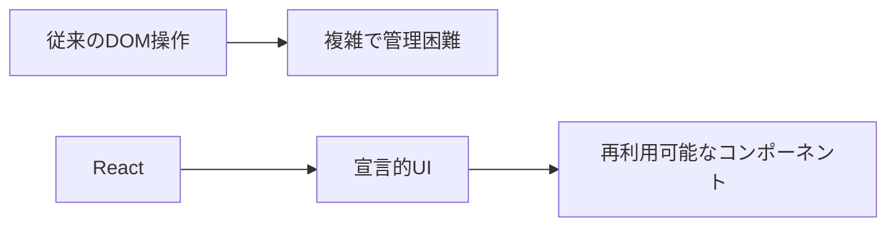

# React基礎

## 📋 概要

| 項目 | 内容 |
|------|------|
| 難易度 | [基礎] |
| 所要時間 | 1-2時間 |
| 前提知識 | TypeScript基礎、HTML/CSS |

## なぜ学ぶ必要があるのか

### Reactが解決する問題



### 実務での重要性

- **業界標準**: 多くの企業で採用されている
- **エコシステム**: 豊富なライブラリとツール
- **求人市場**: React経験者は需要が高い

## Reactの基本概念

### コンポーネント

```typescript
// 関数コンポーネント
function Welcome({ name }: { name: string }) {
  return <h1>Hello, {name}!</h1>;
}

// 使用
<Welcome name="World" />
```

### JSX

```typescript
// JSXはJavaScriptの拡張構文
const element = <h1>Hello, World!</h1>;

// 式の埋め込み
const name = 'World';
const element = <h1>Hello, {name}!</h1>;

// 属性
const element = ;
```

### Props

```typescript
interface UserCardProps {
  name: string;
  email: string;
  age?: number;
}

function UserCard({ name, email, age }: UserCardProps) {
  return (
    <div>
      <h2>{name}</h2>
      <p>{email}</p>
      {age && <p>Age: {age}</p>}
    </div>
  );
}
```

### 条件付きレンダリング

```typescript
function Greeting({ isLoggedIn }: { isLoggedIn: boolean }) {
  return (
    <div>
      {isLoggedIn ? (
        <h1>Welcome back!</h1>
      ) : (
        <h1>Please sign in.</h1>
      )}
    </div>
  );
}
```

### リストのレンダリング

```typescript
function UserList({ users }: { users: User[] }) {
  return (
    <ul>
      {users.map(user => (
        <li key={user.id}>{user.name}</li>
      ))}
    </ul>
  );
}
```

## 学習目標の確認

このコンテンツを読んだ後、以下ができるようになっているはずです：

- [ ] 関数コンポーネントを書ける
- [ ] Propsを使ってデータを渡せる
- [ ] 条件付きレンダリングができる
- [ ] リストをレンダリングできる

## 次のステップ

- [03. React Hooks](02-frontend-development-03.md)

## 参考リソース

- [React公式ドキュメント](https://ja.react.dev/)

---

**著作権表示**

Copyright © 2024 Honeycome Inc. All rights reserved.

本コンテンツは、Honeycome Inc.の所有物です。無断での複製、配布、転載を禁止します。
詳細は[利用規約](../../docs/terms-of-use.md)をご覧ください。
