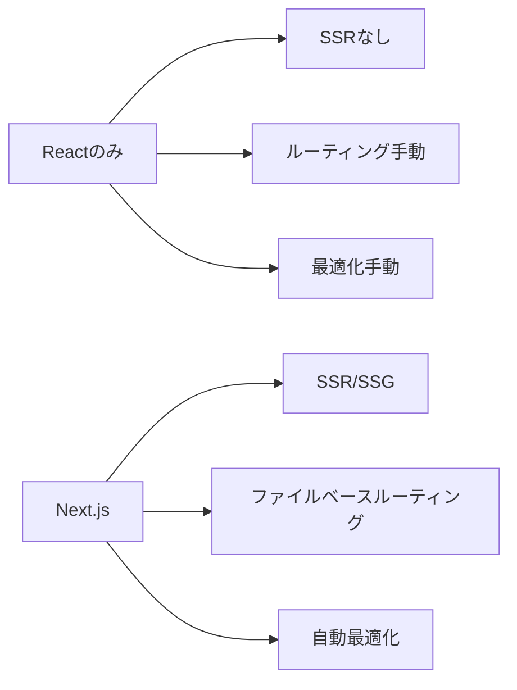

# Next.js

## 📋 概要

| 項目 | 内容 |
|------|------|
| 難易度 | [中級] |
| 所要時間 | 1-2時間 |
| 前提知識 | React基礎 |

## なぜ学ぶ必要があるのか

### Next.jsが解決する問題



### 実務での重要性

- **SSR/SSG**: SEOとパフォーマンスの向上
- **開発効率**: ルーティングやAPI Routesが標準装備
- **業界標準**: 多くの企業で採用されている

## Next.jsの基本

### プロジェクト作成

```bash
npx create-next-app@latest my-app --typescript
cd my-app
npm run dev
```

### ファイルベースルーティング

```
pages/
  index.tsx          → /
  about.tsx          → /about
  users/
    [id].tsx         → /users/:id
    index.tsx        → /users
```

### ページコンポーネント

```typescript
// pages/index.tsx
import { NextPage } from 'next';

const Home: NextPage = () => {
  return <h1>Hello Next.js</h1>;
};

export default Home;
```

### SSR (Server-Side Rendering)

```typescript
import { GetServerSideProps, NextPage } from 'next';

interface Props {
  data: string;
}

const Page: NextPage<Props> = ({ data }) => {
  return <div>{data}</div>;
};

export const getServerSideProps: GetServerSideProps<Props> = async () => {
  const data = await fetchData();
  return { props: { data } };
};

export default Page;
```

### SSG (Static Site Generation)

```typescript
import { GetStaticProps, NextPage } from 'next';

export const getStaticProps: GetStaticProps = async () => {
  const data = await fetchData();
  return { props: { data } };
};
```

### API Routes

```typescript
// pages/api/users.ts
import type { NextApiRequest, NextApiResponse } from 'next';

export default function handler(
  req: NextApiRequest,
  res: NextApiResponse
) {
  if (req.method === 'GET') {
    res.status(200).json({ users: [] });
  } else {
    res.status(405).json({ message: 'Method not allowed' });
  }
}
```

## 学習目標の確認

このコンテンツを読んだ後、以下ができるようになっているはずです：

- [ ] Next.jsプロジェクトを作成できる
- [ ] ファイルベースルーティングを理解している
- [ ] SSRとSSGを使い分けられる
- [ ] API Routesを作成できる

## 次のステップ

- [05. 状態管理](02-frontend-development-05.md)

## 参考リソース

- [Next.js公式ドキュメント](https://nextjs.org/docs)

---

**著作権表示**

Copyright © 2024 Honeycome Inc. All rights reserved.

本コンテンツは、Honeycome Inc.の所有物です。無断での複製、配布、転載を禁止します。
詳細は[利用規約](../../docs/terms-of-use.md)をご覧ください。
