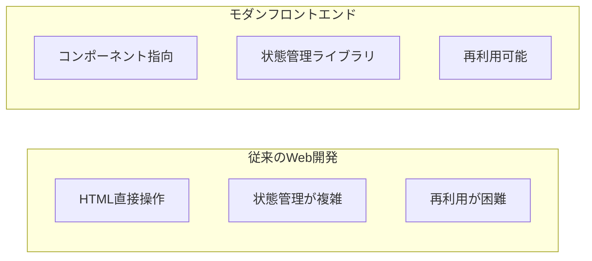
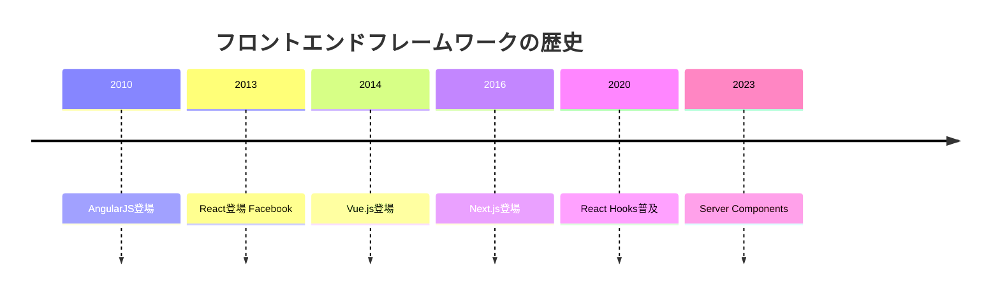

# 02. フロントエンド開発

## 概要

**学習日数**: 4-5日

TypeScriptを使ったモダンフロントエンド開発を学びます。React/Next.jsを使ったコンポーネント開発、状態管理、テストについて理解します。

## なぜ学ぶ必要があるのか

### この技術が解決する問題

### 実務での重要性

- **ユーザー体験**: フロントエンドはユーザーとの接点
- **React/Next.jsの普及**: 多くの企業で採用されている
- **TypeScriptの標準化**: 大規模開発では必須

## 技術の歴史的背景

## 学習内容

| No | コンテンツ | 難易度 | 内容 |
|----|------------|--------|------|
| 01 | [TypeScript復習](02-frontend-development-01.md) | [基礎] | フロントエンドでのTypeScript |
| 02 | [React基礎](02-frontend-development-02.md) | [基礎] | コンポーネント、JSX、Props |
| 03 | [React Hooks](02-frontend-development-03.md) | [中級] | useState、useEffect、カスタムフック |
| 04 | [Next.js](02-frontend-development-04.md) | [中級] | ルーティング、SSR、API Routes |
| 05 | [状態管理](02-frontend-development-05.md) | [中級] | Redux、Zustand |
| 06 | [フロントエンドテスト](02-frontend-development-06.md) | [中級] | Jest、Testing Library |

## 学習目標

- [ ] TypeScriptでReactコンポーネントを書ける
- [ ] React Hooksを使った状態管理ができる
- [ ] Next.jsでアプリケーションを作成できる
- [ ] フロントエンドのテストを書ける

## 参考リソース

- [React公式ドキュメント](https://ja.react.dev/)
- [Next.js公式ドキュメント](https://nextjs.org/docs)

---

**著作権表示**

Copyright © 2024 Honeycome Inc. All rights reserved.

本コンテンツは、Honeycome Inc.の所有物です。無断での複製、配布、転載を禁止します。
詳細は[利用規約](../../../docs/terms-of-use.md)をご覧ください。
