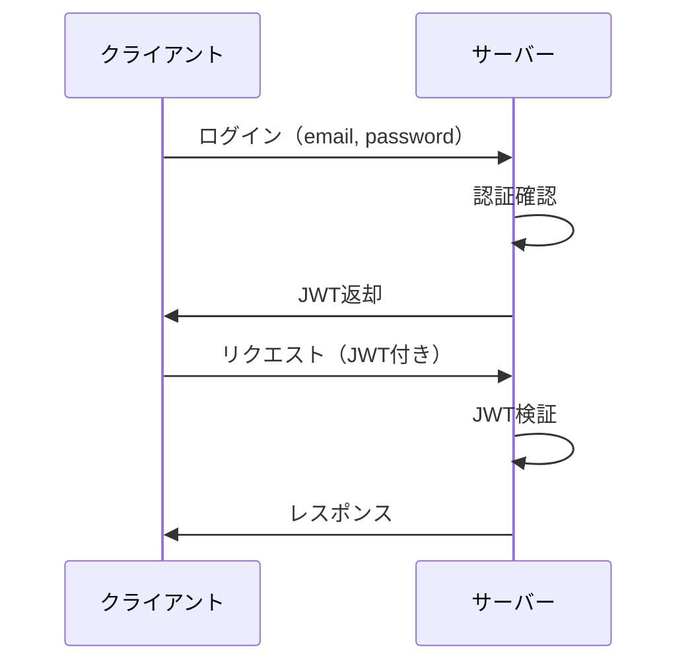

# 認証・認可

## 📋 概要

| 項目 | 内容 |
|------|------|
| 難易度 | [中級] |
| 所要時間 | 1-2時間 |
| 前提知識 | RESTful API開発 |

## なぜ学ぶ必要があるのか

### 認証・認可が解決する問題

- **認証**: ユーザーが誰かを確認
- **認可**: ユーザーが何をできるかを制御

## JWT (JSON Web Token)

### JWTの構造

```
header.payload.signature
```

### JWT生成

```typescript
import jwt from 'jsonwebtoken';

const token = jwt.sign(
  { userId: user.id },
  process.env.JWT_SECRET!,
  { expiresIn: '24h' }
);
```

### JWT検証

```typescript
import jwt from 'jsonwebtoken';

function authenticateToken(req: Request, res: Response, next: NextFunction) {
  const authHeader = req.headers['authorization'];
  const token = authHeader && authHeader.split(' ')[1];
  
  if (!token) {
    return res.status(401).json({ error: 'Token required' });
  }
  
  jwt.verify(token, process.env.JWT_SECRET!, (err, user) => {
    if (err) {
      return res.status(403).json({ error: 'Invalid token' });
    }
    req.user = user;
    next();
  });
}
```

## 認証フロー



## 学習目標の確認

このコンテンツを読んだ後、以下ができるようになっているはずです：

- [ ] JWTを生成・検証できる
- [ ] 認証ミドルウェアを実装できる
- [ ] 認証フローを理解している

## 次のステップ

- [05. 外部API連携](03-backend-development-05.md)

## 参考リソース

- [JWT公式サイト](https://jwt.io/)

---

**著作権表示**

Copyright © 2024 Honeycome Inc. All rights reserved.

本コンテンツは、Honeycome Inc.の所有物です。無断での複製、配布、転載を禁止します。
詳細は[利用規約](../../docs/terms-of-use.md)をご覧ください。
