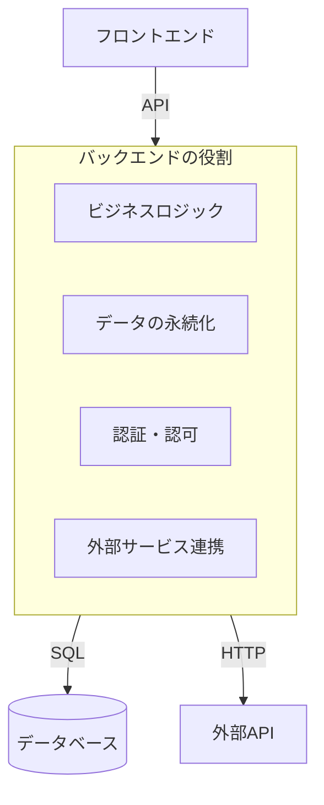
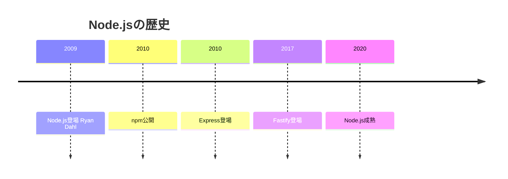

# 03. バックエンド開発

## 概要

**学習日数**: 4-5日

Node.js/TypeScriptを使ったバックエンド開発を学びます。Express/Fastify、RESTful API開発、認証・認可、外部API連携について理解します。

## なぜ学ぶ必要があるのか

### この技術が解決する問題

### 実務での重要性

- **データの安全な管理**: フロントエンドでは扱えない機密情報
- **ビジネスロジックの集約**: 複数クライアントで共通のロジック
- **TypeScriptの統一**: フロントエンドと同じ言語で開発

## 技術の歴史的背景

## 学習内容

| No | コンテンツ | 難易度 | 内容 |
|----|------------|--------|------|
| 01 | [Node.js基礎](03-backend-development-01.md) | [基礎] | Node.jsの仕組み、非同期処理 |
| 02 | [Express/Fastify](03-backend-development-02.md) | [基礎] | フレームワークの使い方 |
| 03 | [RESTful API開発](03-backend-development-03.md) | [中級] | CRUD操作、バリデーション |
| 04 | [認証・認可](03-backend-development-04.md) | [中級] | JWT、OAuth、セッション管理 |
| 05 | [外部API連携](03-backend-development-05.md) | [中級] | HTTPクライアント、エラーハンドリング |

## 学習目標

- [ ] Node.jsの非同期処理を理解している
- [ ] Express/Fastifyでサーバーを作成できる
- [ ] RESTful APIを設計・実装できる
- [ ] JWTを使った認証を実装できる
- [ ] 外部APIと連携できる

## 参考リソース

- [Node.js公式ドキュメント](https://nodejs.org/ja/docs)
- [Express公式ドキュメント](https://expressjs.com/ja/)
- [Fastify公式ドキュメント](https://www.fastify.io/)

---

**著作権表示**

Copyright © 2024 Honeycome Inc. All rights reserved.

本コンテンツは、Honeycome Inc.の所有物です。無断での複製、配布、転載を禁止します。
詳細は[利用規約](../../../docs/terms-of-use.md)をご覧ください。
