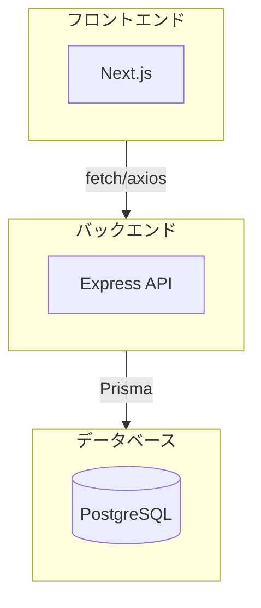

# 04. フルスタック実践

## 概要

**学習日数**: 3-4日

フロントエンドとバックエンドを連携させ、フルスタックアプリケーションを構築する実践的なスキルを学びます。

## なぜ学ぶ必要があるのか

### この技術が解決する問題

フロントエンドとバックエンドを**別々に学ぶ**だけでは、実際のアプリケーションは作れません。

- **データの流れ**を理解する
- **認証フロー**を実装する
- **エラーハンドリング**を統一する

### 実務での重要性

- **End-to-Endの理解**: フロントエンドとバックエンドの両方を理解している人材は貴重
- **デバッグ能力**: 問題がどこで起きているか特定できる
- **効率的な開発**: 両方を見据えた設計ができる

## 学習内容

| No | コンテンツ | 難易度 | 内容 |
|----|------------|--------|------|
| 01 | [フロントエンドとバックエンドの連携](04-fullstack-practice-01.md) | [中級] | API呼び出し、CORS |
| 02 | [データベース連携](04-fullstack-practice-02.md) | [中級] | Prisma、マイグレーション |
| 03 | [認証フロー](04-fullstack-practice-03.md) | [中級] | フルスタック認証の実装 |
| 04 | [パフォーマンス最適化](04-fullstack-practice-04.md) | [応用] | キャッシング、最適化 |

## 学習目標

- [ ] フロントエンドからバックエンドAPIを呼び出せる
- [ ] データベースと連携したCRUD操作ができる
- [ ] フルスタック認証フローを実装できる
- [ ] 基本的なパフォーマンス最適化ができる

## 参考リソース

- [Prisma公式ドキュメント](https://www.prisma.io/docs)

---

**著作権表示**

Copyright © 2024 Honeycome Inc. All rights reserved.

本コンテンツは、Honeycome Inc.の所有物です。無断での複製、配布、転載を禁止します。
詳細は[利用規約](../../../docs/terms-of-use.md)をご覧ください。
