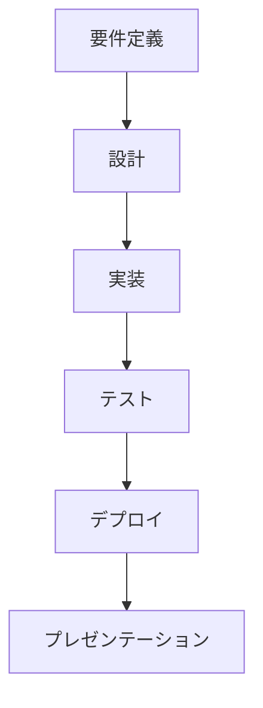
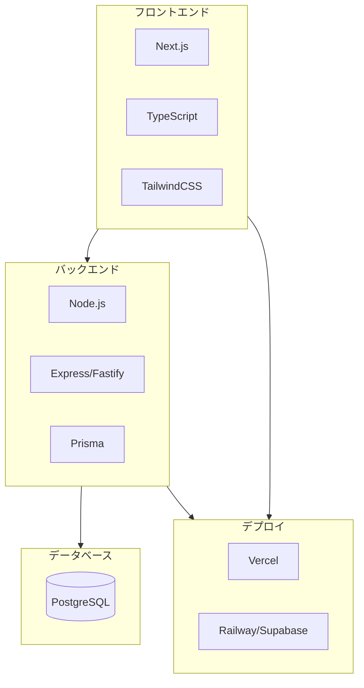

# 05. 応用演習（Capstone Project）

## 概要

**学習日数**: 5-7日

これまで学んだ知識を総動員して、フルスタックWebアプリケーションを開発します。要件定義から実装、デプロイ、プレゼンテーションまでを行います。

## 応用演習の目的

- **知識の統合**: 学んだ技術を組み合わせて実際のアプリを作る
- **実践経験**: 要件定義からデプロイまでの一連の流れを経験
- **成果物**: ポートフォリオとして使える成果物を作る

## 成果物の要件

### 必須要件

- [ ] フロントエンド: Next.js/TypeScript
- [ ] バックエンド: Node.js/TypeScript API
- [ ] データベース: PostgreSQL
- [ ] 認証機能
- [ ] CRUD操作
- [ ] テストコード
- [ ] デプロイ済み

### 技術スタック

## 進め方

### Week 1: 要件定義・設計（Day 1-2）

1. **アプリのテーマ決め**
   - メンターと相談してテーマを決定
   - 規模は小さめでOK

2. **要件定義**
   - 機能一覧
   - 画面一覧
   - データモデル

3. **設計**
   - 画面設計（ワイヤーフレーム）
   - API設計
   - データベース設計

### Week 1-2: 実装（Day 3-5）

1. **環境構築**
   - プロジェクト作成
   - Docker環境構築

2. **バックエンド実装**
   - データベース設計
   - API実装
   - 認証実装

3. **フロントエンド実装**
   - コンポーネント作成
   - API連携
   - 状態管理

4. **テスト**
   - ユニットテスト
   - 結合テスト

### Week 2: デプロイ・プレゼン（Day 6-7）

1. **デプロイ**
   - フロントエンド: Vercel
   - バックエンド: Railway/Render
   - データベース: Supabase/Railway

2. **プレゼンテーション準備**
   - スライド作成
   - デモ準備

3. **プレゼンテーション**
   - 作成したアプリの説明
   - 技術的な工夫点
   - 学んだこと

## 評価基準

| 項目 | 内容 | 配点 |
|------|------|------|
| 機能 | 要件を満たしているか | 30% |
| コード品質 | 可読性、保守性、テスト | 30% |
| 設計 | アーキテクチャ、API設計 | 20% |
| プレゼン | 説明のわかりやすさ | 20% |

## テーマ例

### 初級

- **Todoアプリ**: 基本的なCRUD操作
- **メモアプリ**: マークダウン対応
- **掲示板**: 投稿とコメント

### 中級

- **タスク管理**: カンバンボード
- **ブックマーク管理**: タグ、検索機能
- **日報アプリ**: カレンダー表示

### 上級

- **チャットアプリ**: WebSocket
- **SNS的な機能**: フォロー、タイムライン
- **ECサイト的な機能**: カート、決済（モック）

## サポート

- **メンター**: 週1回の1on1セッション
- **Slack**: 質問や議論
- **コードレビュー**: PRで随時レビュー

## 参考リソース

- [Vercelデプロイガイド](https://vercel.com/docs)
- [Railwayデプロイガイド](https://docs.railway.app/)
- [Supabaseドキュメント](https://supabase.com/docs)

---

**著作権表示**

Copyright © 2024 Honeycome Inc. All rights reserved.

本コンテンツは、Honeycome Inc.の所有物です。無断での複製、配布、転載を禁止します。
詳細は[利用規約](../../../docs/terms-of-use.md)をご覧ください。
