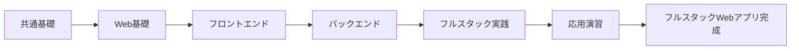

# Webエンジニアコース

## 概要

フルスタックWebアプリケーション開発を学ぶコースです。

**学習期間**: 2-3週間（80-120時間）
**前提条件**: 共通基礎を修了していること

## コースの目標



このコースを修了すると、以下ができるようになります：

- [ ] HTTPプロトコルとWebの仕組みを理解している
- [ ] TypeScript/React/Next.jsでフロントエンドを開発できる
- [ ] Node.js/TypeScriptでバックエンドAPIを開発できる
- [ ] フルスタックWebアプリケーションを設計・実装・デプロイできる

## 技術スタック

```mermaid
flowchart TB
    subgraph frontend[フロントエンド]
        HTML[HTML/CSS]
        TS1[TypeScript]
        REACT[React]
        NEXT[Next.js]
    end
    
    subgraph backend[バックエンド]
        NODE[Node.js]
        TS2[TypeScript]
        EXPRESS[Express/Fastify]
    end
    
    subgraph database[データベース]
        PG[(PostgreSQL)]
    end
    
    subgraph infra[インフラ]
        DOCKER[Docker]
        VERCEL[Vercel]
    end
    
    frontend -->|HTTP| backend
    backend -->|SQL| database
```

| レイヤー | 技術 |
|----------|------|
| フロントエンド | TypeScript, React, Next.js |
| バックエンド | TypeScript, Node.js, Express/Fastify |
| データベース | PostgreSQL |
| インフラ | Docker, Vercel |

## カテゴリ一覧

| No | カテゴリ | 学習日数 | 内容 |
|----|----------|----------|------|
| 01 | [Web基礎](01-web-fundamentals/) | 2-3日 | HTTP、HTML/CSS、ブラウザの仕組み |
| 02 | [フロントエンド開発](02-frontend-development/) | 4-5日 | TypeScript、React/Next.js、状態管理 |
| 03 | [バックエンド開発](03-backend-development/) | 4-5日 | Node.js、Express/Fastify、API開発 |
| 04 | [フルスタック実践](04-fullstack-practice/) | 3-4日 | フロントエンドとバックエンドの連携 |
| 05 | [応用演習](05-capstone-project/) | 5-7日 | フルスタックWebアプリケーション開発 |

## 学習の進め方


1. 各カテゴリのREADME.mdと各コンテンツを読む
2. tests/web/配下のテストで理解度を確認
3. exercises/web/配下の課題に取り組む
4. 課題をプルリクエストで提出
5. メンターのレビューを受ける
6. 承認されたら次のカテゴリへ

## 成果物

コース修了時には、以下の成果物を作成します：

- **フルスタックWebアプリケーション**
  - フロントエンド: React/Next.js
  - バックエンド: Node.js/Express
  - データベース: PostgreSQL
  - デプロイ済み

## 次のステップ

Webエンジニアコースを修了したら、以下のコースに進むことができます：

- [iOS/Androidアプリエンジニアコース](../mobile/) - 差分学習（0.5-1ヶ月）
- [IoTエンジニアコース](../iot/) - フルコース（1-1.5ヶ月）

---

**著作権表示**

Copyright © 2024 Honeycome Inc. All rights reserved.

本コンテンツは、Honeycome Inc.の所有物です。無断での複製、配布、転載を禁止します。
詳細は[利用規約](../../../docs/terms-of-use.md)をご覧ください。
