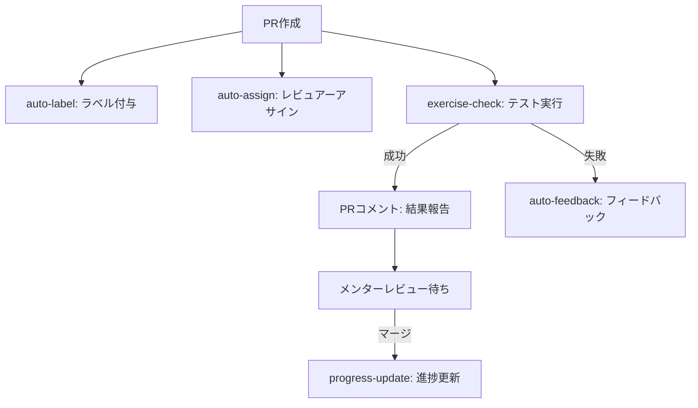
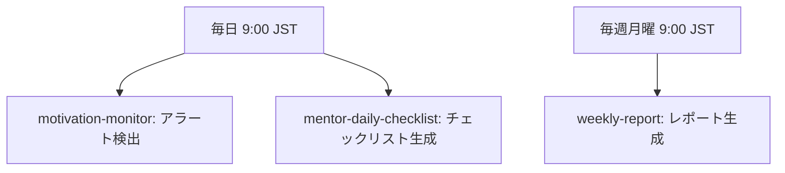

# 自動化システム実装サマリー

## 📋 概要

メンターの負荷を減らすための自動化システムが完全に実装されています。

## ✅ 実装済み機能

### GitHub Actionsワークフロー（8ファイル）

#### 基本ワークフロー（PR/イベント駆動）

1. **`exercise-check.yml`**
   - **トリガー**: PR作成/更新
   - **機能**: テスト実行、Lint、型チェック
   - **出力**: PRにコメントで結果を投稿

2. **`auto-label.yml`**
   - **トリガー**: PR作成/更新
   - **機能**: カテゴリに応じたラベル自動付与
   - **ラベル**: コース名、カテゴリ名、研修生名

3. **`auto-feedback.yml`**
   - **トリガー**: `exercise-check`ワークフロー失敗時
   - **機能**: 自動フィードバックコメント生成
   - **内容**: ヒント、質問テンプレート

4. **`auto-assign.yml`**
   - **トリガー**: PR作成
   - **機能**: CODEOWNERSからレビュアー自動アサイン
   - **フォールバック**: 環境変数`DEFAULT_MENTORS`

5. **`progress-update.yml`**
   - **トリガー**: PRマージ
   - **機能**: 進捗ファイル自動更新
   - **安全機能**: `[skip ci]`で無限ループ防止

#### 定期実行ワークフロー（スケジュール）

6. **`weekly-report.yml`**
   - **トリガー**: 毎週月曜 9:00 JST
   - **機能**: 週次進捗レポート生成
   - **出力**: GitHub Issue

7. **`motivation-monitor.yml`**
   - **トリガー**: 毎日 9:00 JST
   - **機能**: モチベーション・進捗アラート検出
   - **検出項目**:
     - モチベーション低下（3日連続平均2以下）
     - 進捗停滞（3日以上更新なし）
     - PR活動停滞（7日以上PRなし）

8. **`mentor-daily-checklist.yml`**
   - **トリガー**: 毎日 9:00 JST
   - **機能**: メンターデイリーチェックリスト生成
   - **チェック項目**:
     - レビュー待ちPR
     - Slackの質問（手動確認）
     - モチベーションアラート
     - 新しいIssue
     - 週次レポート確認（月曜）
     - 1on1準備（金曜）

### 自動化スクリプト（4ディレクトリ）

1. **`feedback-generators/`**
   - `code-feedback-generator.js`: コードパターン検出
   - `test-feedback-generator.js`: テスト結果解析
   - `index.js`: 統合フィードバック生成

2. **`review-scripts/`**
   - `auto-review.js`: PR変更ファイルの自動レビュー

3. **`test-runners/`**
   - `exercise-test-runner.js`: 課題テスト実行

4. **`certificate-generator/`**
   - 修了証生成システム（既存実装）

## 🔄 自動化フロー

### PR提出時の自動化フロー



### 定期実行フロー



## 📊 効果

### メンターの負荷削減

| 作業 | 自動化前 | 自動化後 | 削減率 |
|------|---------|---------|--------|
| テスト実行確認 | 手動 | 自動 | 100% |
| Lint/型チェック | 手動 | 自動 | 100% |
| ラベル付け | 手動 | 自動 | 100% |
| 進捗更新 | 手動 | 自動 | 100% |
| 週次レポート | 手動 | 自動 | 100% |
| モチベーション監視 | 手動 | 自動 | 100% |
| デイリーチェックリスト | 手動 | 自動 | 100% |

### メンターが集中できる作業

- ✅ 設計レビュー
- ✅ 成長支援
- ✅ 1on1
- ✅ コンテンツ改善

## 🚀 使用方法

### ワークフローの手動実行

```bash
# GitHub Actionsから手動実行可能
# Actions > ワークフロー選択 > Run workflow
```

### スクリプトの直接実行

```bash
# フィードバック生成
node automation/feedback-generators/index.js exercises/common/01-git-basics

# テスト実行
node automation/test-runners/exercise-test-runner.js exercises/common/01-git-basics

# 自動レビュー
node automation/review-scripts/auto-review.js exercises/common/01-git-basics/index.ts
```

## 📚 関連ドキュメント

- [レビュー自動化設計](review-automation.md)
- [メンター用運用ガイド](https://github.com/honeycome-bootcamp/bootcamp-v2-mentor/blob/main/docs/mentor-guide.md)（メンター専用リポジトリ）
- [実装状況](implementation-status.md)

---

**最終更新**: 2024年12月
