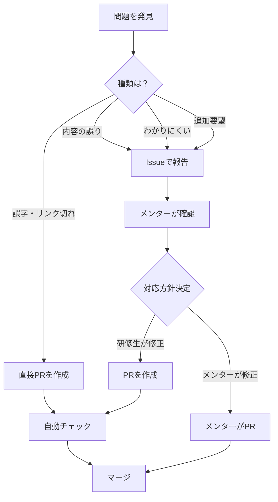
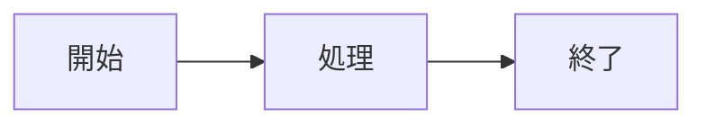

# コンテンツ改善ガイド

## 概要

研修コンテンツの品質向上のため、研修生からのフィードバックを歓迎します。
誤字脱字、わかりにくい説明、技術的な誤りなど、気づいたことがあれば報告してください。

## フィードバックの種類と対応方法



## 1. Issue（問題報告）の作成

### 1.1 いつIssueを作るか

以下の場合はIssueで報告してください：

| 種類 | 例 |
|------|-----|
| **内容の誤り** | サンプルコードが動かない、説明が間違っている |
| **わかりにくい** | 説明が不足、前提知識が必要 |
| **追加要望** | 図が欲しい、例を増やしてほしい |
| **リンク切れ** | 参考リンクがアクセスできない |

### 1.2 Issueの作成手順

1. [Issues](../../issues) ページを開く
2. 「New issue」をクリック
3. テンプレートを選択
4. 必要事項を記入して「Submit new issue」

### 1.3 Issue テンプレート

#### コンテンツの誤り報告

```markdown
## 対象コンテンツ
<!-- どのファイルに問題がありますか？ -->
content/common/01-git-basics/01-git-basics-01.md

## 問題の種類
- [ ] 技術的な誤り
- [ ] サンプルコードが動かない
- [ ] 説明が間違っている
- [ ] リンク切れ
- [ ] その他

## 問題の詳細
<!-- 具体的に何が問題ですか？ -->

## 期待する内容
<!-- どうあるべきですか？ -->

## 補足情報
<!-- スクリーンショットや参考リンクがあれば -->
```

#### わかりにくい箇所の報告

```markdown
## 対象コンテンツ
<!-- どのファイルですか？ -->

## わかりにくい箇所
<!-- どの部分がわかりにくいですか？ -->

## つまずいたポイント
<!-- 具体的にどこでつまずきましたか？ -->

## 改善提案（あれば）
<!-- こうしたら良いという案があれば -->
```

## 2. PR（修正）の作成

### 2.1 いつ直接PRを作るか

以下の**軽微な修正**は、Issueなしで直接PRを作成してOKです：

- 誤字脱字の修正
- 明らかなタイポ
- リンクの修正
- フォーマットの修正

### 2.2 PRの作成手順

#### Step 1: ブランチを作成

```bash
# mainを最新に
git checkout main
git pull origin main

# 修正用ブランチを作成
git checkout -b fix/content-typo-git-basics
```

#### Step 2: 修正を行う

```bash
# ファイルを編集
# content/common/01-git-basics/01-git-basics-01.md など
```

#### Step 3: コミット & プッシュ

```bash
git add .
git commit -m "fix: Git基礎の誤字を修正"
git push origin fix/content-typo-git-basics
```

#### Step 4: PRを作成

GitHubで「Compare & pull request」をクリック

### 2.3 PR テンプレート

```markdown
## 修正の種類
- [ ] 誤字脱字
- [ ] 技術的な誤りの修正
- [ ] 説明の改善
- [ ] 図・画像の追加
- [ ] リンクの修正
- [ ] その他

## 対象コンテンツ
<!-- 修正したファイル -->

## 修正内容
<!-- 何をどう修正したか -->

## 関連Issue
<!-- あれば -->
Fixes #123

## チェックリスト
- [ ] 内容を確認した
- [ ] Markdownのプレビューを確認した
- [ ] リンクが正しいことを確認した
```

## 3. コンテンツ修正のガイドライン

### 3.1 Markdownの書き方

```markdown
# 見出し1（ファイルに1つ）

## 見出し2

### 見出し3

**太字** は重要な用語に使用

`コード` はインラインコードに使用

```typescript
// コードブロック
const example = "Hello";
```

> 引用は補足情報に使用

- リスト項目
- リスト項目

1. 番号付きリスト
2. 番号付きリスト

| 表 | 表 |
|----|-----|
| 内容 | 内容 |
```

### 3.2 図の追加（Mermaid）

```markdown

```

### 3.3 画像の追加

```markdown

```

- 画像は `content/{category}/images/` に配置
- ファイル名は英数字とハイフンのみ
- サイズは1MB以下推奨

### 3.4 リンクの書き方

```markdown
<!-- 相対リンク（同じリポジトリ内） -->
[Git基礎](../01-git-basics/README.md)

<!-- 外部リンク -->
[公式ドキュメント](https://example.com/)
```

## 4. レビュープロセス

### 4.1 自動チェック

PRを作成すると、以下が自動でチェックされます：

- Markdownの構文
- リンク切れ
- 画像の存在確認

### 4.2 メンターレビュー

コンテンツの修正は、メンターが以下を確認します：

- 技術的な正確性
- 説明のわかりやすさ
- 全体との整合性

### 4.3 マージ

- 軽微な修正: 1人の承認でマージ
- 大きな変更: 2人以上の承認が必要

## 5. 貢献へのお礼

コンテンツ改善に貢献していただいた方は、以下に記録されます：

- [CONTRIBUTORS.md](../CONTRIBUTORS.md)
- PRのマージ履歴

研修コンテンツの品質向上にご協力いただき、ありがとうございます！

## 6. 質問

貢献方法についてわからないことがあれば、[GitHub Discussions](../../discussions) で質問してください。
