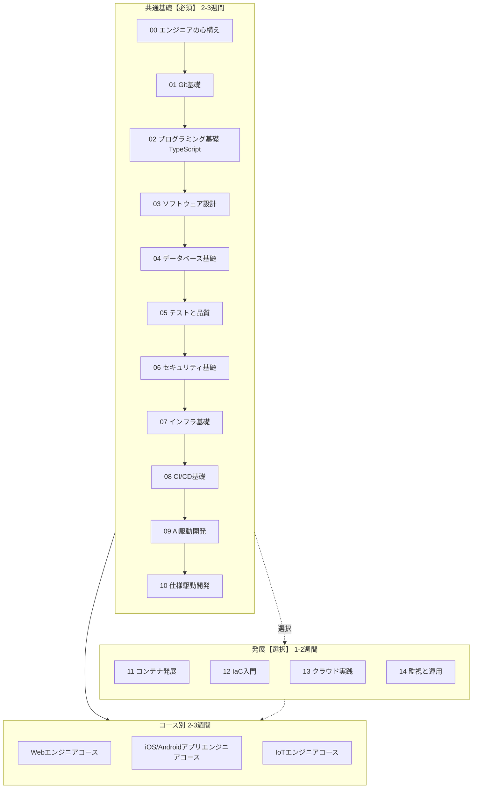
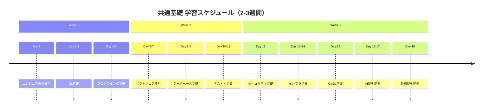
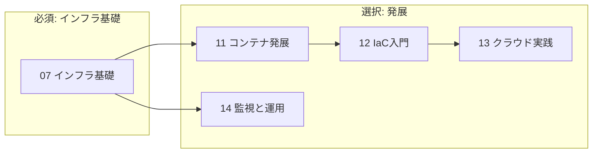
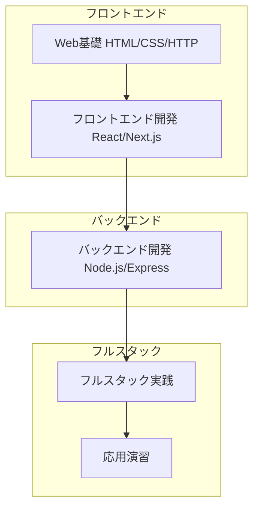
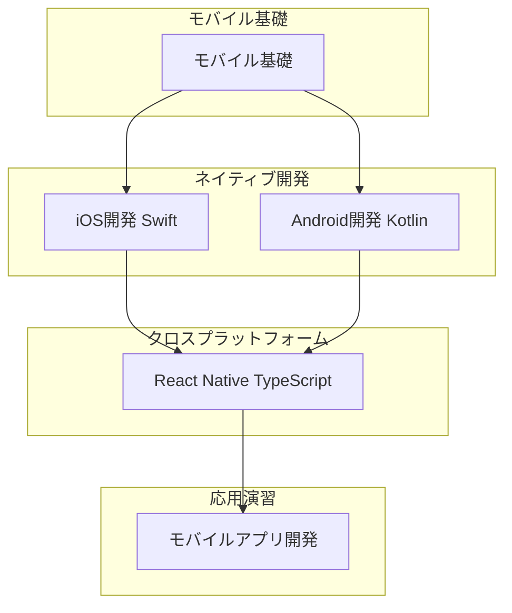
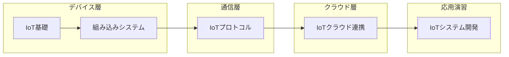
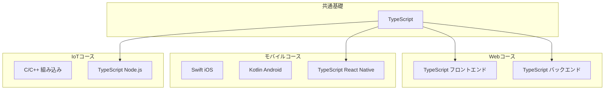

# カリキュラム概要

## 1. カリキュラム全体像

> 💡 **発展カテゴリ（11-14）は選択コンテンツ**です。必須ではありませんが、DevOps/インフラに興味がある方、実務で必要になる方におすすめです。

## 2. 学習時間配分

### 2.1 全体スケジュール

| フェーズ | 期間 | 学習時間 | 必須/選択 |
|----------|------|----------|----------|
| 共通基礎（00-10） | 2-3週間 | 80-120時間 | **必須** |
| 発展（11-14） | 1-2週間 | 40-80時間 | 選択 |
| コース別 | 2-3週間 | 80-120時間 | **必須** |

| パターン | 期間 | 説明 |
|----------|------|------|
| **最短コース** | 4-6週間 | 共通基礎 + コース別のみ |
| **標準コース** | 5-7週間 | 共通基礎 + 発展一部 + コース別 |
| **フルコース** | 6-8週間 | 共通基礎 + 発展全部 + コース別 |

### 2.2 コース別期間

| コース | 最短 | 発展含む | Webコース後 |
|--------|------|----------|-------------|
| Webエンジニアコース | 1-1.5ヶ月 | 1.5-2ヶ月 | - |
| iOS/Androidアプリエンジニアコース | 1-1.5ヶ月 | 1.5-2ヶ月 | 0.5-1ヶ月（差分学習） |
| IoTエンジニアコース | 1-1.5ヶ月 | 1.5-2ヶ月 | - |

## 3. 共通基礎カリキュラム

全コースで共通して学ぶ基礎知識です。

### 3.1 概要

### 3.2 カテゴリ詳細

#### 00. エンジニアの心構え（1日）

**なぜ学ぶ必要があるのか**
- 技術力だけでは優秀なエンジニアにはなれない
- 報連相や進捗報告はチーム開発の基本
- 手段と目的を区別する思考が、正しい技術選定につながる

**学習内容**
| トピック | 内容 |
|----------|------|
| 心構えの基本 | プロ意識、成長マインドセット、誠実さ |
| コミュニケーション | 報連相、進捗報告、質問の技術 |
| 目的志向の思考 | 手段と目的、ビジネス視点、MVP |
| 継続的な学習 | 情報収集、アンテナの張り方、アウトプット |

**ゴール**
- [ ] 適切なタイミングで報連相ができる
- [ ] 進捗を効果的に共有できる
- [ ] 手段と目的を区別して考えられる
- [ ] 継続的に技術情報をキャッチアップできる

---

#### 01. Git基礎（1-2日）

**なぜ学ぶ必要があるのか**
- バージョン管理の重要性：コードの変更履歴を管理し、過去の状態に戻せる
- チーム開発での必須スキル：複数人での協働開発に不可欠
- AI時代における重要性：AI生成コードの変更履歴を管理し、問題発生時に原因を特定

**技術の歴史的背景**
- 2005年、Linus TorvaldsがLinuxカーネルの開発のために作成
- CVS、Subversion等の中央集約型から分散型への転換
- GitHub（2008年）の登場により、オープンソース開発が加速

**学習内容**
| トピック | 内容 |
|----------|------|
| Gitの基本概念 | リポジトリ、コミット、ブランチ等 |
| 基本コマンド | clone, add, commit, push, pull |
| ブランチ戦略 | Git Flow、GitHub Flow |
| マージ | マージとコンフリクト解決 |
| GitHub | GitHubの使い方 |
| プルリクエスト | PRの作成とレビュー |

#### 02. プログラミング基礎（3-4日）

**なぜ学ぶ必要があるのか**
- プログラミングの基礎：すべての開発の土台となる知識
- 型安全性：TypeScriptの型システムにより、実行時エラーを事前に防ぐ
- AI時代における重要性：AI生成コードの型エラーを見抜き、正しいコードを判断できる

**技術の歴史的背景**
- JavaScript（1995年）の誕生：Netscape Navigator用のスクリプト言語
- TypeScript（2012年）の登場：Microsoftが開発、JavaScriptに型システムを追加
- ES6（2015年）以降の進化：モダンJavaScriptの機能が標準化
- TypeScriptの普及：大規模開発での採用が増加、2020年代に主流に

**学習内容**
| トピック | 内容 |
|----------|------|
| 基本構文 | 変数、データ型、制御構造 |
| 関数 | 関数とモジュール |
| オブジェクト指向 | クラス、継承、インターフェース |
| 型システム | 型推論、型アノテーション、ジェネリクス |
| エラー処理 | エラーハンドリング |
| デバッグ | デバッグの基礎 |

#### 03. ソフトウェア設計（2-3日）

**学習内容**
| トピック | 内容 |
|----------|------|
| SOLID原則 | 単一責任、オープン・クローズド、リスコフの置換、インターフェース分離、依存性逆転 |
| 設計パターン | Factory、Singleton、Observer、Strategy等 |
| アーキテクチャ | レイヤード、クリーンアーキテクチャ |
| コード品質 | 可読性と保守性 |

#### 04. データベース基礎（2-3日）

**学習内容**
| トピック | 内容 |
|----------|------|
| 基本概念 | RDB、NoSQL、データモデル |
| SQL | SELECT、INSERT、UPDATE、DELETE、JOIN |
| データベース設計 | 正規化、ER図 |
| トランザクション | ACID特性、分離レベル |

#### 05. テストと品質（2-3日）

**学習内容**
| トピック | 内容 |
|----------|------|
| テストの種類 | 単体テスト、結合テスト、E2Eテスト |
| 単体テスト | Jest、Vitestの使い方 |
| TDD | テスト駆動開発の基礎 |
| カバレッジ | コードカバレッジの測定 |

#### 06. セキュリティ基礎（1-2日）

**学習内容**
| トピック | 内容 |
|----------|------|
| 基本概念 | 機密性、完全性、可用性 |
| OWASP Top 10 | よくある脆弱性 |
| 認証・認可 | 認証と認可の違い |
| セキュアコーディング | 入力検証、出力エスケープ |

#### 07. インフラ基礎（2-3日）

**学習内容**
| トピック | 内容 |
|----------|------|
| サーバー | サーバーの基礎 |
| ネットワーク | TCP/IP、DNS、HTTP |
| クラウド | AWS/GCP/Azureの基本概念 |
| コンテナ | Dockerの基礎 |

#### 08. CI/CD基礎（1-2日）

**学習内容**
| トピック | 内容 |
|----------|------|
| CI/CD概念 | 継続的インテグレーション、継続的デリバリー |
| GitHub Actions | ワークフローの作成 |
| 自動テスト | CIでのテスト実行 |
| デプロイ | 基本的なデプロイパイプライン |

#### 09. AI駆動開発（2-3日）

**なぜ学ぶ必要があるのか**
- 開発効率の向上：AI支援により、コード生成速度が飛躍的に向上
- 基礎知識の重要性：AIの間違いを見抜くためには、基礎知識が不可欠
- 現代の開発スタイル：AIと協働する開発が標準になりつつある
- 正しいフローの理解：AIに振り回されず、目的を持って活用する

**技術の歴史的背景**
- GitHub Copilot（2021年）：OpenAIのCodexを活用した最初の大規模AIコーディング支援
- ChatGPT（2022年）：汎用AIチャットボットがコード生成にも活用
- Cursor（2023年）：AIファーストなエディタとして登場
- AIコーディング支援の進化：コード補完から、コード生成、リファクタリング支援へ

**学習内容**
| トピック | 内容 |
|----------|------|
| AIツール概要 | GitHub Copilot、Cursor、ChatGPT等 |
| Cursor | Cursorの基本操作 |
| プロンプト | 効果的なプロンプトの書き方 |
| レビュー | AI生成コードのレビュー方法 |
| 開発フロー | AIと協働する開発フロー |
| 限界 | AIの限界と注意点 |

#### 10. 仕様駆動開発（1-2日）

**学習内容**
| トピック | 内容 |
|----------|------|
| 仕様書 | 仕様書の読み方・書き方 |
| 要件定義 | 要件定義の基礎 |
| 設計書 | 設計書の作成 |
| 実装 | 仕様から実装への落とし込み |
| 変更対応 | 仕様変更への対応 |

---

### 3.3 発展カテゴリ【選択】

> ⚠️ **以下のカテゴリは選択コンテンツです。** 必須ではありませんが、DevOps/インフラエンジニアを目指す方や、実務で必要になる方におすすめです。

#### 11. コンテナ発展【選択】（3-4日）

**こんな人におすすめ**
- Docker Composeやマルチコンテナ構成を使う予定がある
- DevOps/インフラエンジニアを目指している

**前提知識**: 07. インフラ基礎（Docker基礎）

**学習内容**
| トピック | 内容 |
|----------|------|
| OS・プロセス基礎 | プロセス、名前空間、cgroups |
| 仮想化技術理論 | VM vs コンテナ、仮想化の仕組み |
| Docker Compose基礎 | compose.yaml、サービス定義 |
| マルチコンテナ構成 | ネットワーク、ボリューム、依存関係 |
| 本番運用ベストプラクティス | セキュリティ、最適化、ログ |

#### 12. IaC入門（AWS CDK）【選択】（2-3日）

**こんな人におすすめ**
- インフラをコードで管理したい
- AWSインフラの構築・運用に興味がある

**前提知識**: 07. インフラ基礎、02. プログラミング基礎（TypeScript）

**学習内容**
| トピック | 内容 |
|----------|------|
| IaCの概念と必要性 | IaCとは、なぜ必要か |
| AWS CDK基礎 | CDKプロジェクト、スタック、Constructs |
| AWS CDK実践 | VPC、Lambda、S3の構築 |

> 💡 **TypeScriptが使える**: 研修で学んだTypeScriptでインフラを定義できます。
> ⚠️ **費用注意**: AWSリソースを作成すると費用が発生する可能性があります。研修ではLocalStack等のローカル環境を使用します。

#### 13. クラウド実践【選択】（3-4日）

**こんな人におすすめ**
- クラウドでの本番運用を学びたい
- コンテナオーケストレーション（ECS/Fargate）に興味がある

**前提知識**: 07. インフラ基礎、推奨: 11. コンテナ発展

**学習内容**
| トピック | 内容 |
|----------|------|
| クラウドアーキテクチャ | Well-Architected、設計原則 |
| ネットワーク設計 | VPC、サブネット、セキュリティグループ |
| ECS/Fargate基礎 | タスク定義、サービス、クラスター |
| 本番運用 | ロードバランサー、オートスケーリング |

> ⚠️ **費用注意**: AWSリソースを作成すると費用が発生する可能性があります。学習後は必ずリソースを削除してください。

#### 14. 監視と運用【選択】（2-3日）

**こんな人におすすめ**
- 本番サービスの運用に興味がある
- SRE/DevOpsエンジニアを目指している

**前提知識**: 07. インフラ基礎

**学習内容**
| トピック | 内容 |
|----------|------|
| 監視の基本概念 | なぜ監視が必要か、監視の種類 |
| ログ管理 | 構造化ログ、集約、検索 |
| メトリクス監視 | 主要メトリクス、ダッシュボード |
| アラートとインシデント対応 | アラート設計、オンコール、ポストモーテム |

> 💡 **無料で学習可能**: Prometheus + Grafanaなど、無料のOSSツールで学習できます。

## 4. Webエンジニアコース

### 4.1 概要

フルスタックWebアプリケーション開発を学びます。

### 4.2 カテゴリ詳細

#### 01. Web基礎（2-3日）

| トピック | 内容 |
|----------|------|
| HTTP | HTTPプロトコルの基礎 |
| HTML/CSS | HTML/CSSの基礎 |
| ブラウザ | ブラウザの仕組み |
| REST API | REST API設計の基礎 |

#### 02. フロントエンド開発（4-5日）

| トピック | 内容 | コンテンツ |
|----------|------|-----------|
| TypeScript | TypeScript基礎（共通基礎の復習と応用） | [詳細コンテンツ](../content/web/02-frontend-development/) |
| React | React/Next.jsの基礎 | [詳細コンテンツ](../content/web/02-frontend-development/) |
| 状態管理 | Redux、Zustand等 | [詳細コンテンツ](../content/web/02-frontend-development/) |
| テスト | フロントエンドのテスト | [詳細コンテンツ](../content/web/02-frontend-development/) |

#### 03. バックエンド開発（4-5日）

| トピック | 内容 | コンテンツ |
|----------|------|-----------|
| Node.js | Node.js/TypeScriptでのサーバーサイド開発 | [詳細コンテンツ](../content/web/03-backend-development/) |
| フレームワーク | Express/Fastify | [詳細コンテンツ](../content/web/03-backend-development/) |
| API開発 | RESTful API開発 | [詳細コンテンツ](../content/web/03-backend-development/) |
| 認証・認可 | JWT、OAuth等 | [詳細コンテンツ](../content/web/03-backend-development/) |
| 外部API | 外部API連携 | [詳細コンテンツ](../content/web/03-backend-development/) |

#### 04. フルスタック実践（3-4日）

| トピック | 内容 |
|----------|------|
| 連携 | フロントエンドとバックエンドの連携 |
| データベース | データベースとの連携 |
| セッション | セッション管理 |
| 最適化 | パフォーマンス最適化 |

#### 05. 応用演習（5-7日）

| 内容 |
|------|
| 要件定義から実装まで |
| フルスタックWebアプリケーション開発 |
| デプロイと運用 |
| プレゼンテーション準備 |

## 5. iOS/Androidアプリエンジニアコース

### 5.1 概要

モバイルアプリ開発を学びます。Webコース後は差分学習のみ（0.5-1ヶ月）。

### 5.2 カテゴリ詳細

#### 01. モバイル基礎（1-2日）

| トピック | 内容 | コンテンツ |
|----------|------|-----------|
| 特徴 | モバイルアプリの特徴 | [詳細コンテンツ](../content/mobile/01-mobile-fundamentals/) |
| プラットフォーム | iOS/Androidの違い | [詳細コンテンツ](../content/mobile/01-mobile-fundamentals/) |
| UI/UX | モバイルUI/UXの基礎 | [詳細コンテンツ](../content/mobile/01-mobile-fundamentals/) |
| ライフサイクル | アプリのライフサイクル | [詳細コンテンツ](../content/mobile/01-mobile-fundamentals/) |

#### 02. iOS開発（3-4日）

| トピック | 内容 |
|----------|------|
| Swift | Swift基礎 |
| UI | UIKit/SwiftUI |
| アーキテクチャ | iOSアーキテクチャパターン |
| 公開 | App Storeへの公開準備 |

#### 03. Android開発（3-4日）

| トピック | 内容 | コンテンツ |
|----------|------|-----------|
| Kotlin | Kotlin基礎 | [詳細コンテンツ](../content/mobile/03-android-development/) |
| SDK | Android SDK | [詳細コンテンツ](../content/mobile/03-android-development/) |
| アーキテクチャ | Androidアーキテクチャパターン | [詳細コンテンツ](../content/mobile/03-android-development/) |
| 公開 | Google Playへの公開準備 | [詳細コンテンツ](../content/mobile/03-android-development/) |

#### 04. クロスプラットフォーム（2-3日）

| トピック | 内容 |
|----------|------|
| React Native | React Native基礎（TypeScript） |
| ネイティブ連携 | ネイティブモジュールとの連携 |
| 最適化 | パフォーマンス最適化 |
| ツール | Expo等の開発ツール |

#### 05. 応用演習（3-5日）

| 内容 |
|------|
| 要件定義から実装まで |
| モバイルアプリ開発 |
| ストア公開準備 |
| プレゼンテーション準備 |

### 5.3 Webコース後の差分学習

Webコースを修了した場合、以下の部分のみ学習：

| カテゴリ | 差分学習の内容 |
|----------|----------------|
| モバイル基礎 | モバイル固有のUI/UX、ライフサイクル |
| iOS開発 | Swift、UIKit/SwiftUI |
| Android開発 | Kotlin、Android SDK |
| クロスプラットフォーム | React Nativeの差分（Reactの知識を活用） |
| 応用演習 | モバイルアプリ開発 |

## 6. IoTエンジニアコース

### 6.1 概要

IoTシステム開発を学びます。

### 6.2 カテゴリ詳細

#### 01. IoT基礎（2-3日）

| トピック | 内容 | コンテンツ |
|----------|------|-----------|
| 基本概念 | IoTの基本概念 | [詳細コンテンツ](../content/iot/01-iot-fundamentals/) |
| ハードウェア | マイコン、センサーの基礎 | [詳細コンテンツ](../content/iot/01-iot-fundamentals/) |
| エッジ | エッジコンピューティング | [詳細コンテンツ](../content/iot/01-iot-fundamentals/) |
| アーキテクチャ | IoTアーキテクチャ | [詳細コンテンツ](../content/iot/01-iot-fundamentals/) |

#### 02. 組み込みシステム（4-5日）

| トピック | 内容 |
|----------|------|
| 低レベル制御 | C/C++によるマイコン直接制御 |
| 高レベル制御 | TypeScript/Node.js（Raspberry Pi等） |
| リアルタイム | リアルタイムシステム |
| 省電力 | 低電力設計 |
| インターフェース | ハードウェアインターフェース |

#### 03. IoTプロトコル（2-3日）

| トピック | 内容 | コンテンツ |
|----------|------|-----------|
| MQTT | MQTTプロトコル | [詳細コンテンツ](../content/iot/03-iot-protocols/) |
| CoAP | CoAPプロトコル | [詳細コンテンツ](../content/iot/03-iot-protocols/) |
| 無線通信 | Wi-Fi、Bluetooth、LoRa等 | [詳細コンテンツ](../content/iot/03-iot-protocols/) |
| 選択基準 | プロトコル選択の判断基準 | [詳細コンテンツ](../content/iot/03-iot-protocols/) |

#### 04. IoTクラウド連携（3-4日）

| トピック | 内容 | コンテンツ |
|----------|------|-----------|
| AWS IoT | AWS IoTの基礎 | [詳細コンテンツ](../content/iot/04-iot-cloud-integration/) |
| デバイス連携 | デバイスからのデータ送信 | [詳細コンテンツ](../content/iot/04-iot-cloud-integration/) |
| データ収集 | データ収集と分析 | [詳細コンテンツ](../content/iot/04-iot-cloud-integration/) |
| 可視化 | ダッシュボードでの監視 | [詳細コンテンツ](../content/iot/04-iot-cloud-integration/) |
| セキュリティ | IoTセキュリティ | [詳細コンテンツ](../content/iot/04-iot-cloud-integration/) |

#### 05. 応用演習（5-7日）

| 内容 |
|------|
| 要件定義から実装まで |
| IoTシステム開発 |
| デプロイと運用 |
| プレゼンテーション準備 |

## 7. プログラミング言語の方針

### 7.1 言語選択マップ

### 7.2 言語別用途

| 言語 | 用途 |
|------|------|
| TypeScript | 共通基礎、Web全般、React Native、IoT高レベル制御 |
| Swift | iOSネイティブ開発 |
| Kotlin | Androidネイティブ開発 |
| C/C++ | IoT組み込み、低レベル制御 |

## 8. 難易度マーカー

各コンテンツには難易度マーカーが付いています。

| マーカー | 対象 | 説明 |
|----------|------|------|
| [基礎] | 完全初心者向け | プログラミング未経験者でも理解できる |
| [中級] | 2-3年経験者向け | 基礎的な知識がある前提で進める |
| [応用] | 両方のレベルで挑戦可能 | 発展的な内容、スキップ可能 |

## 9. 応用演習について

### 9.1 目的

各カテゴリで学んだ知識を組み合わせて、実際の成果物を作成します。

### 9.2 成果物

| コース | 成果物 |
|--------|--------|
| Web | フルスタックWebアプリケーション |
| モバイル | ストア公開可能なモバイルアプリ |
| IoT | 動作するIoTシステム |

### 9.3 評価基準

| 項目 | 内容 |
|------|------|
| 機能 | 要件を満たしているか |
| コード品質 | 可読性、保守性 |
| テスト | テストが書かれているか |
| ドキュメント | README、設計書 |
| プレゼン | 説明のわかりやすさ |

## 10. 関連ドキュメント

- [要件定義書](requirements.md)
- [研修生向けガイド](student-guide.md)
- [レビュー自動化設計](review-automation.md)
- [プラットフォーム選択の比較](platform-comparison.md)
- [メンター用運用ガイド](https://github.com/honeycome-bootcamp/bootcamp-v2-mentor/blob/main/docs/mentor-guide.md)（メンター専用リポジトリ）
