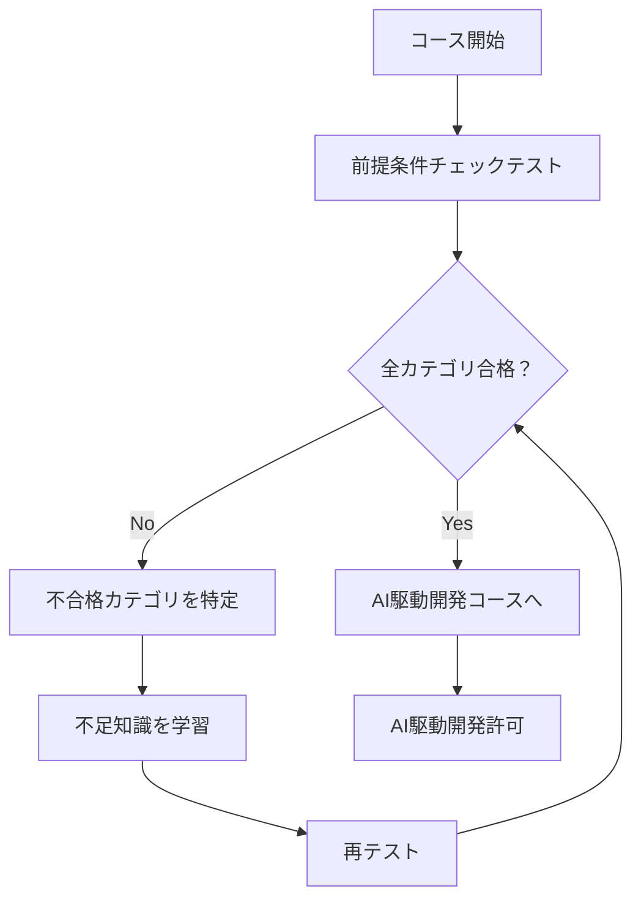

# 経験エンジニア向け AI駆動開発前提条件コース

## 1. 概要

このコースは、**実務経験のあるエンジニアがAI駆動開発を許可される前に、必要な基礎知識を確認・補完するためのコース**です。

### 1.1 目的

AI駆動開発を安全に活用するためには、以下の基礎知識が不可欠です：

1. **AIの間違いを見抜く力** - 基礎知識がないと、AIの出力が正しいか判断できない
2. **正しい開発フローの理解** - AIに振り回されず、目的を持ってAIを活用できる
3. **セキュリティ意識** - AI生成コードに潜む脆弱性を発見できる
4. **品質保証の知識** - AI生成コードを適切にテストできる

### 1.2 対象者

以下の条件を満たすエンジニア：

- ✅ 実務経験が2年以上ある
- ✅ プログラミング言語を1つ以上使ったことがある
- ✅ Gitの基本操作ができる
- ✅ 何かしらのアプリケーションを開発した経験がある

### 1.3 コースの流れ



## 2. 前提条件チェックテスト

### 2.1 テストの実施方法

1. **全カテゴリの理解度チェックテストを実施**
   - 各カテゴリ（01-08）のテストを順番に解く
   - 所要時間：約2-3時間（全8カテゴリ）

2. **合格基準**
   - 各カテゴリで**80%以上**の正答率が必要
   - 1つでも不合格カテゴリがある場合は、そのカテゴリを学習

3. **テスト実施場所**
   - `tests/common/01-git-basics/`
   - `tests/common/02-programming-fundamentals/`
   - `tests/common/03-software-design/`
   - `tests/common/04-database-basics/`
   - `tests/common/05-testing-quality/`
   - `tests/common/06-security-basics/`
   - `tests/common/07-infrastructure-basics/`
   - `tests/common/08-ci-cd-basics/`

### 2.2 各カテゴリの必須知識

#### 01. Git基礎

**必須知識**：
- [ ] リポジトリ、コミット、ブランチの概念を理解している
- [ ] `git clone`, `git add`, `git commit`, `git push`, `git pull`が使える
- [ ] ブランチ戦略（Git Flow、GitHub Flow）を理解している
- [ ] マージとコンフリクト解決ができる
- [ ] プルリクエストの作成とレビューができる

**なぜ必要か**：
- AI生成コードの変更履歴を管理するため
- 問題発生時に原因を特定するため
- チーム開発での協働のため

#### 02. プログラミング基礎（TypeScript）

**必須知識**：
- [ ] TypeScriptの型システムを理解している
- [ ] 型推論、型アノテーション、ジェネリクスが使える
- [ ] エラーハンドリングが適切にできる
- [ ] オブジェクト指向プログラミングの基本を理解している

**なぜ必要か**：
- AI生成コードの型エラーを見抜くため
- AIに適切な型情報を提供するため
- 型安全性を保つため

#### 03. ソフトウェア設計

**必須知識**：
- [ ] SOLID原則を理解している
- [ ] 設計パターン（Factory、Singleton、Observer等）を知っている
- [ ] レイヤードアーキテクチャを理解している
- [ ] コードの可読性と保守性を意識できる

**なぜ必要か**：
- AI生成コードの設計品質を判断するため
- AIに適切な設計指示を出せるため
- リファクタリングの必要性を判断するため

#### 04. データベース基礎

**必須知識**：
- [ ] SQLの基本（SELECT、INSERT、UPDATE、DELETE、JOIN）が使える
- [ ] トランザクションとACID特性を理解している
- [ ] 正規化の基本を理解している
- [ ] ORMの基本概念を理解している

**なぜ必要か**：
- AI生成SQLの安全性を判断するため
- SQLインジェクションなどの脆弱性を見抜くため
- 適切なデータベース設計を指示できるため

#### 05. テストと品質

**必須知識**：
- [ ] 単体テスト、統合テストの違いを理解している
- [ ] テスト駆動開発（TDD）の基本を理解している
- [ ] テストカバレッジの概念を理解している
- [ ] モックとスタブを使える

**なぜ必要か**：
- AI生成コードを適切にテストするため
- AI生成コードの品質を保証するため
- テストが不足している箇所を見抜くため

#### 06. セキュリティ基礎

**必須知識**：
- [ ] SQLインジェクション、XSS、CSRFなどの脆弱性を知っている
- [ ] 認証と認可の違いを理解している
- [ ] パスワードの適切な扱い方を知っている
- [ ] HTTPS、暗号化の基本を理解している

**なぜ必要か**：
- **最重要**：AI生成コードに潜むセキュリティ脆弱性を見抜くため
- セキュアなコードをAIに生成させるため
- セキュリティリスクを判断するため

#### 07. インフラ基礎

**必須知識**：
- [ ] Dockerの基本概念を理解している
- [ ] Dockerfileの書き方を知っている
- [ ] コンテナとイメージの違いを理解している
- [ ] 基本的なDockerコマンドが使える

**なぜ必要か**：
- AI生成のDockerfileの妥当性を判断するため
- インフラ構成の適切性を判断するため

#### 08. CI/CD基礎

**必須知識**：
- [ ] CI/CDの概念を理解している
- [ ] GitHub Actionsの基本を理解している
- [ ] パイプラインの構成を理解している
- [ ] 自動テストの実行方法を知っている

**なぜ必要か**：
- AI生成コードを自動テストで検証するため
- CI/CDパイプラインの適切性を判断するため

## 3. 学習方法

### 3.1 ステップ1: テスト実施

```bash
# 各カテゴリのテストを実施
# 例：Git基礎のテスト
cd tests/common/01-git-basics/
npm test
```

### 3.2 ステップ2: 結果の確認

各カテゴリのテスト結果を記録：

| カテゴリ | 正答率 | 合格/不合格 | 備考 |
|----------|--------|------------|------|
| 01 Git基礎 | 95% | ✅ 合格 | - |
| 02 プログラミング基礎 | 65% | ❌ 不合格 | 型システムが弱い |
| 03 ソフトウェア設計 | 85% | ✅ 合格 | - |
| 04 データベース基礎 | 90% | ✅ 合格 | - |
| 05 テストと品質 | 70% | ❌ 不合格 | TDDの理解不足 |
| 06 セキュリティ基礎 | 75% | ❌ 不合格 | 必須なので再学習 |
| 07 インフラ基礎 | 88% | ✅ 合格 | - |
| 08 CI/CD基礎 | 82% | ✅ 合格 | - |

### 3.3 ステップ3: 不足知識の学習

不合格カテゴリについて、以下の順序で学習：

1. **該当カテゴリのREADMEを読む**
   - `content/common/XX-カテゴリ名/README.md`

2. **コンテンツを学習**
   - 特に[中級]マーカーのコンテンツを重点的に
   - 理解度が低い部分のみを学習

3. **実践課題に取り組む（必要に応じて）**
   - `exercises/common/XX-カテゴリ名/`

4. **再テストを実施**
   - 80%以上になるまで繰り返す

### 3.4 優先順位

不合格カテゴリがある場合の学習優先順位：

1. **最優先（必須）**：
   - **06 セキュリティ基礎** - AI生成コードの脆弱性を見抜くために必須
   - **02 プログラミング基礎** - 型システムの理解はAI活用に不可欠

2. **高優先度**：
   - **05 テストと品質** - AI生成コードの品質保証に必要
   - **03 ソフトウェア設計** - AI生成コードの設計品質を判断するため

3. **中優先度**：
   - **04 データベース基礎** - SQL生成の安全性を判断するため
   - **01 Git基礎** - 変更履歴管理のため

4. **低優先度**：
   - **07 インフラ基礎** - Dockerfile生成の妥当性判断
   - **08 CI/CD基礎** - 自動テストの実行

## 4. AI駆動開発許可の条件

### 4.1 必須条件

以下の**すべて**を満たす必要があります：

- [ ] 全カテゴリ（01-08）の理解度チェックテストで80%以上を取得
- [ ] 特に**06 セキュリティ基礎**は90%以上を取得（必須）
- [ ] **02 プログラミング基礎**は85%以上を取得（推奨）

### 4.2 許可後の流れ

1. **AI駆動開発コースの受講**
   - `content/common/09-ai-driven-development/`を学習

2. **実践課題の実施**
   - AI駆動開発の実践課題に取り組む

3. **メンターによる確認**
   - AI生成コードのレビュー能力を確認

4. **正式な許可**
   - メンターが承認したら、AI駆動開発ツールの使用を許可

## 5. よくある質問

### Q1: すべてのカテゴリを学習する必要がありますか？

**A**: いいえ。理解度チェックテストで80%以上を取得できたカテゴリは、学習をスキップできます。不合格カテゴリのみを学習してください。

### Q2: セキュリティ基礎が90%以上必要なのはなぜですか？

**A**: AI生成コードには、SQLインジェクション、XSS、認証の不備などのセキュリティ脆弱性が含まれる可能性が高いです。セキュリティ基礎が不十分だと、これらの脆弱性を見抜けず、本番環境に重大なリスクをもたらす可能性があります。

### Q3: プログラミング基礎の型システムが重要視されるのはなぜですか？

**A**: TypeScriptの型システムを理解していないと、AI生成コードの型エラーを見抜けません。また、AIに適切な型情報を提供できないため、AIの出力品質が低下します。

### Q4: テストに合格できない場合はどうすればいいですか？

**A**: 該当カテゴリのコンテンツを学習し、実践課題に取り組んでから再テストしてください。それでも合格できない場合は、メンターに相談してください。

### Q5: このコースの所要時間は？

**A**: 
- テスト実施：2-3時間
- 不足知識の学習：1-5日（不合格カテゴリの数による）
- 合計：1-5日程度

## 6. チェックリスト

### 前提条件チェック

- [ ] 全カテゴリ（01-08）の理解度チェックテストを実施
- [ ] 各カテゴリの結果を記録
- [ ] 不合格カテゴリを特定

### 学習実施

- [ ] 不合格カテゴリのREADMEを読む
- [ ] 該当コンテンツを学習
- [ ] 実践課題に取り組む（必要に応じて）
- [ ] 再テストを実施
- [ ] 80%以上を取得

### AI駆動開発許可申請

- [ ] 全カテゴリで80%以上を取得
- [ ] セキュリティ基礎で90%以上を取得
- [ ] プログラミング基礎で85%以上を取得（推奨）
- [ ] メンターに許可申請

## 7. 修了証について

### 7.1 前提条件コース修了証

前提条件コースを完了し、AI駆動開発許可を取得した場合、**前提条件コース修了証**が発行されます。

**発行条件**:
- 全カテゴリ（01-08）の理解度チェックテストで80%以上を取得
- セキュリティ基礎（06）で90%以上を取得
- メンターによるAI駆動開発許可の承認

**修了証の内容**:
- 研修生名
- コース名: 「AI駆動開発前提条件コース」
- 修了日
- 各カテゴリのテスト結果
- メンター署名

**保存場所**:
- `progress/students/{受講者名}/certificates/certificate-prerequisites-{日付}.pdf`
- `progress/students/{受講者名}/certificates/certificate-prerequisites-{日付}.md`

### 7.2 正式なコース修了証

前提条件コース修了後、AI駆動開発コース（09）と仕様駆動開発コース（10）を完了し、さらにコース別学習を完了すると、**正式なコース修了証**が発行されます。

**発行条件**:
- 共通基礎（00-10）の全カテゴリを完了
- コース別（Web/モバイル/IoT）の全カテゴリを完了
- 応用演習の評価が完了

**修了証の種類**:
- 共通基礎コース修了証
- Webエンジニアコース修了証
- モバイルエンジニアコース修了証
- IoTエンジニアコース修了証

詳細は[研修生向けガイド](student-guide.md)の「修了証について」セクションを参照してください。

## 8. 関連ドキュメント

- [研修生向けガイド](student-guide.md) - 全体の学習ガイド
- [カリキュラム概要](curriculum-overview.md) - カリキュラム全体像
- [AI駆動開発](../content/common/09-ai-driven-development/README.md) - AI駆動開発コース

---

**重要**: このコースは、AI駆動開発を安全に活用するための**前提条件**です。基礎知識が不十分なままAI駆動開発を許可すると、セキュリティリスクや品質問題を引き起こす可能性があります。必ず全カテゴリで合格基準を満たしてから、AI駆動開発コースに進んでください。
