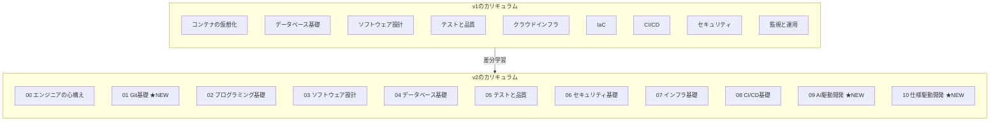
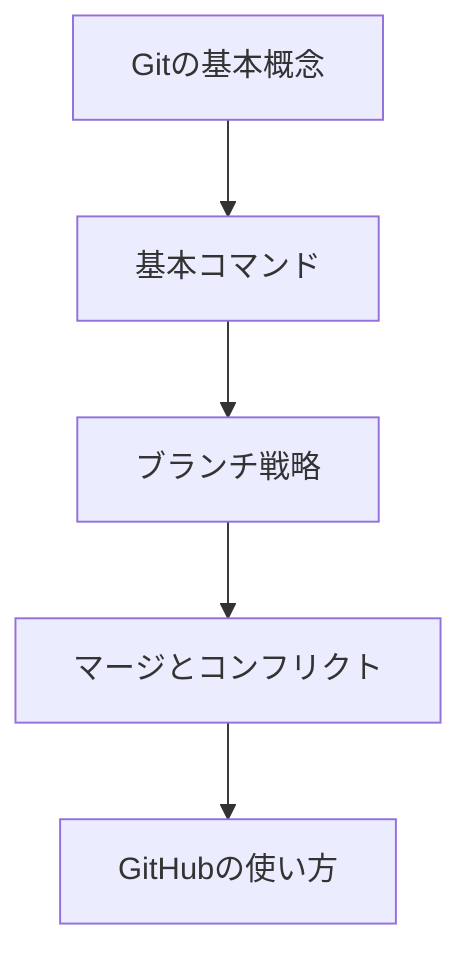
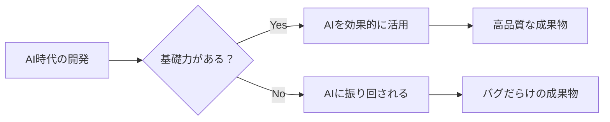
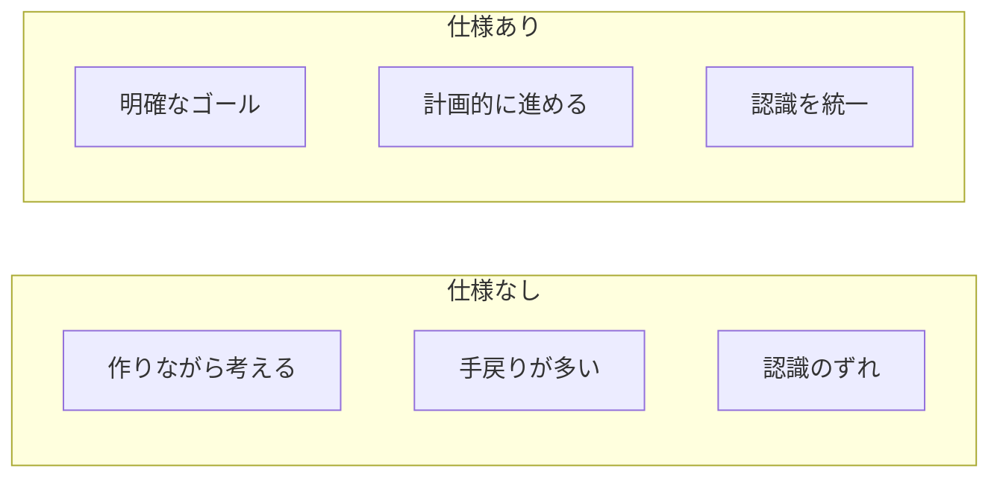
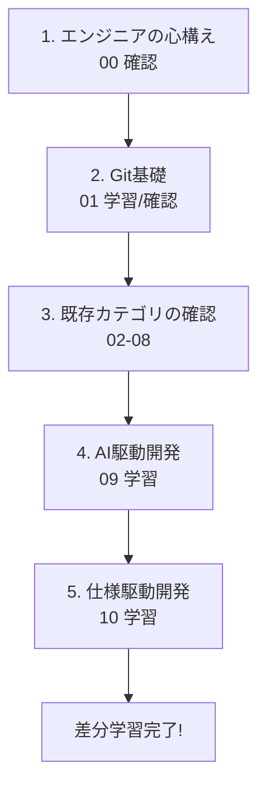

# 旧コンテンツ受講者向け差分学習ガイド（v1 → v2）

## 目次

1. [はじめに](#1-はじめに)
2. [v1とv2の主な違い](#2-v1とv2の主な違い)
3. [新規コンテンツの学習ガイド](#3-新規コンテンツの学習ガイド)
4. [既存コンテンツの確認ポイント](#4-既存コンテンツの確認ポイント)
5. [学習の進め方](#5-学習の進め方)
6. [差分学習チェックリスト](#6-差分学習チェックリスト)
7. [よくある質問](#7-よくある質問)

---

## 1. はじめに

### このガイドの目的

このガイドは、**旧バージョン（v1）の研修を受講された方**が、新バージョン（v2）との差分を効率的に学習するためのものです。

v1で学んだ知識を活かしながら、v2で新たに追加・改善された内容に集中して学習できるよう構成しています。

### 差分学習の所要時間

| 内容 | 所要時間 |
|------|----------|
| 新規コンテンツの学習 | **4-7日** |
| 既存コンテンツの確認 | **1-2日** |
| **合計** | **約1週間** |

> 既にv1を修了している場合、フルコース（4-6週間）を最初からやり直す必要はありません。

---

## 2. v1とv2の主な違い

### 2.1 概要図



### 2.2 新規追加されたコンテンツ（3つ）

v2では、以下の3つのコンテンツが**新たに追加**されました。これらは**必ず学習してください**。

| No | コンテンツ | 学習日数 | 追加の理由 |
|----|-----------|----------|-----------|
| 01 | **Git基礎** | 1-2日 | 超基礎として全エンジニアに必須 |
| 09 | **AI駆動開発** | 2-3日 | AI時代への対応 |
| 10 | **仕様駆動開発** | 1-2日 | 実務での重要性 |

### 2.3 カリキュラム構造の変更

| 項目 | v1 | v2 |
|------|----|----|
| カテゴリ番号 | 統一されていない | 00-10で統一 |
| エンジニアの心構え | なし | 00番として新設 |
| Git基礎 | なし（省略されていた） | 01番として新設 |
| AI駆動開発 | なし | 09番として新設 |
| 仕様駆動開発 | なし | 10番として新設 |
| 発展カテゴリ | 一部混在 | 11-14として選択制に整理 |

### 2.4 既存コンテンツの改善

v2では、v1にあったコンテンツも以下の点が改善されています：

| 改善点 | 内容 |
|--------|------|
| **理解度チェックテスト** | 各カテゴリにテストを追加（読めば解けるレベル） |
| **実践課題の改善** | 「難しすぎる」という声を受けて改善 |
| **歴史的背景の追加** | 各技術の誕生と進化の過程を解説 |
| **Mermaid図の活用** | アーキテクチャ図、フロー図で視覚的に理解 |
| **AI時代の観点** | 各技術がAI時代になぜ重要かを追記 |

---

## 3. 新規コンテンツの学習ガイド

### 3.1 Git基礎（01）

#### なぜ追加されたか

v1では「Gitくらい知っているだろう」という前提で省略されていましたが、以下の理由から追加されました：

- 採用面接で「Gitの経験」を問われることが増えた
- AI生成コードの変更履歴管理が重要になった
- 基礎が曖昧なまま進むと後で困る

#### 学習内容



| トピック | 内容 |
|----------|------|
| Gitの基本概念 | リポジトリ、コミット、ブランチ |
| 基本コマンド | clone, add, commit, push, pull |
| ブランチ戦略 | Git Flow、GitHub Flow |
| マージとコンフリクト | マージ、リベース、コンフリクト解決 |
| GitHubの使い方 | プルリクエスト、Issues |

#### 既にGitを使っている場合

以下のチェックリストで確認してください。すべて「はい」なら、コンテンツを読み流す程度でOKです。

- [ ] `git rebase` と `git merge` の違いを説明できる
- [ ] コンフリクトを解決できる
- [ ] Git FlowまたはGitHub Flowを説明できる
- [ ] プルリクエストの作成とレビューができる

#### 学習時間の目安

| 状況 | 時間 |
|------|------|
| Git初心者 | 1-2日（しっかり学習） |
| Git経験あり | 半日（確認程度） |

#### コンテンツへのリンク

[content/common/01-git-basics/README.md](../content/common/01-git-basics/README.md)

---

### 3.2 AI駆動開発（09）

#### なぜ追加されたか

GitHub Copilot、Cursor、ChatGPT等のAIツールが普及し、開発スタイルが大きく変わりました。



**重要**: このコンテンツは「AIを使えば基礎は不要」ではなく、「**基礎があってこそAIを活用できる**」という考え方に基づいています。

#### 学習内容

| トピック | 内容 |
|----------|------|
| AIツール概要 | GitHub Copilot、Cursor、ChatGPT、Claude |
| Cursorの使い方 | AIファーストエディタの基本操作 |
| プロンプトエンジニアリング | 効果的なプロンプトの書き方 |
| AI生成コードのレビュー | 従来の基礎知識を活用したレビュー |
| AIと協働する開発フロー | 要件定義→AI生成→レビュー→修正 |
| AIの限界と注意点 | セキュリティ、パフォーマンス、ライセンス |

#### 学習のポイント

**AIの間違いを見抜く例**：

```typescript
// AIが生成したコード（一見正しそう）
async function getUser(id: string) {
  const user = await db.query(`SELECT * FROM users WHERE id = '${id}'`);
  return user;
}

// 問題点：SQLインジェクションの脆弱性！
// v1で学んだセキュリティの知識があれば気づける
```

#### 学習時間の目安

| 状況 | 時間 |
|------|------|
| AIツール未経験 | 2-3日（しっかり学習） |
| AIツール経験あり | 1-2日（体系的に整理） |

#### コンテンツへのリンク

[content/common/09-ai-driven-development/README.md](../content/common/09-ai-driven-development/README.md)

---

### 3.3 仕様駆動開発（10）

#### なぜ追加されたか

v1では「作りながら考える」スタイルに偏りがちでしたが、実務では以下が重要です：

- チーム開発では仕様書で認識を統一
- 見積もりには明確な仕様が必要
- AIへの指示も「仕様」の一種



#### 学習内容

| トピック | 内容 |
|----------|------|
| 仕様書の読み方・書き方 | 仕様書の構成、読み方、書き方 |
| 要件定義 | 機能要件、非機能要件、優先順位 |
| 設計書の作成 | 基本設計、詳細設計 |
| 仕様から実装へ | 仕様を実装に落とし込む方法 |

#### AI時代との関係

仕様を明確に書けると、AIへの指示（プロンプト）も明確になります。

```
曖昧な指示: 「ユーザー管理機能を作って」
明確な指示: 「以下の仕様でユーザー登録APIを作成してください:
            - POST /api/users
            - リクエスト: { name: string, email: string }
            - レスポンス: { id: number, name: string, email: string }
            - バリデーション: emailは形式チェック」
```

#### 学習時間の目安

| 状況 | 時間 |
|------|------|
| 仕様書経験なし | 1-2日（しっかり学習） |
| 仕様書経験あり | 半日-1日（体系的に整理） |

#### コンテンツへのリンク

[content/common/10-spec-driven-development/README.md](../content/common/10-spec-driven-development/README.md)

---

## 4. 既存コンテンツの確認ポイント

v1で学んだコンテンツについても、v2での改善点を確認することをおすすめします。

### 4.1 エンジニアの心構え（00）

v1にはなかったカテゴリです。以下の内容を確認してください：

| 確認項目 | 内容 |
|----------|------|
| 報連相 | 適切なタイミングでの報告・連絡・相談 |
| 目的志向 | 手段と目的の区別、ビジネス視点 |
| 継続学習 | 技術情報のキャッチアップ方法 |

[content/common/00-engineer-mindset/README.md](../content/common/00-engineer-mindset/README.md)

### 4.2 プログラミング基礎（02）

v2では以下が追加・改善されています：

- TypeScriptの歴史的背景
- AI時代における型システムの重要性
- 型エラーでAIの間違いを見抜く方法

**確認のポイント**: v1で学んだ内容 + 「AI時代における重要性」セクションを読む

### 4.3 ソフトウェア設計（03）

v2では以下が追加・改善されています：

- SOLID原則の実践的な適用例
- AIが生成した設計の妥当性評価

### 4.4 データベース基礎（04）

v2では以下が追加・改善されています：

- SQLインジェクション対策（AI生成コードの典型的な問題）
- AI生成SQLのレビューポイント

### 4.5 テストと品質（05）

v2では以下が追加・改善されています：

- AI生成コードのテスト方法
- TDDとAI駆動開発の組み合わせ

### 4.6 セキュリティ基礎（06）

v2では以下が追加・改善されています：

- AI生成コードのセキュリティリスク
- AIによる脆弱性検出の限界

### 4.7 インフラ基礎（07）

v2では構成が整理されています：

- v1のDockerコンテンツ → v2の「07. インフラ基礎」+ 「11. コンテナ発展（選択）」
- より基礎から段階的に学べる構成に

### 4.8 CI/CD基礎（08）

v2では以下が追加・改善されています：

- GitHub Actionsの詳細
- AI生成コードとCI/CDの連携

### 4.9 理解度チェックテストについて

v2では各カテゴリに理解度チェックテストが追加されています。

- 場所: `tests/common/{カテゴリ}/`
- 難易度: コンテンツを読めば解けるレベル
- 目的: 理解度の確認、復習の指針

**v1修了者へ**: すべてのテストを解く必要はありませんが、自信がないカテゴリのテストに挑戦すると、復習ポイントが明確になります。

---

## 5. 学習の進め方

### 5.1 推奨学習順序



### 5.2 スキップ可能な内容の判断基準

| 状況 | 対応 |
|------|------|
| 理解度テストに合格できる | スキップ可能 |
| 日常業務で問題なく使えている | スキップ可能 |
| 説明を求められると自信がない | 学習推奨 |
| AIとの協働での活用法がわからない | 該当セクションを読む |

### 5.3 既存知識の確認方法

1. **理解度チェックテスト**に挑戦
2. 間違えた問題の関連コンテンツを読む
3. 「AI時代における重要性」セクションを確認

### 5.4 学習スケジュール例

| 日 | 内容 | 時間 |
|----|------|------|
| 1日目 | エンジニアの心構え（00）確認 + Git基礎（01）前半 | 4-6時間 |
| 2日目 | Git基礎（01）後半 + 既存カテゴリ確認開始 | 4-6時間 |
| 3日目 | 既存カテゴリ確認完了 | 4-6時間 |
| 4日目 | AI駆動開発（09）前半 | 4-6時間 |
| 5日目 | AI駆動開発（09）後半 | 4-6時間 |
| 6日目 | 仕様駆動開発（10） | 4-6時間 |
| 7日目 | 復習、理解度テスト、完了確認 | 4-6時間 |

---

## 6. 差分学習チェックリスト

### 6.1 新規コンテンツの学習

#### Git基礎（01）
- [ ] Gitの基本概念を理解した
- [ ] 基本コマンドを実行できる
- [ ] ブランチ戦略を説明できる
- [ ] コンフリクトを解決できる
- [ ] GitHubでプルリクエストを作成できる
- [ ] 理解度チェックテストに合格した

#### AI駆動開発（09）
- [ ] AIツールの種類と特徴を説明できる
- [ ] Cursorの基本操作ができる
- [ ] 効果的なプロンプトを書ける
- [ ] AI生成コードの問題点を指摘できる
- [ ] AIと協働する開発フローを実践できる
- [ ] AIの限界を理解している
- [ ] 理解度チェックテストに合格した

#### 仕様駆動開発（10）
- [ ] 仕様書を読み、理解できる
- [ ] 簡単な仕様書を書ける
- [ ] 要件定義の基本を理解している
- [ ] 仕様から実装への落とし込みができる
- [ ] 理解度チェックテストに合格した

### 6.2 既存コンテンツの確認

- [ ] エンジニアの心構え（00）を確認した
- [ ] プログラミング基礎（02）のAI関連セクションを読んだ
- [ ] ソフトウェア設計（03）の改善点を確認した
- [ ] データベース基礎（04）の改善点を確認した
- [ ] テストと品質（05）の改善点を確認した
- [ ] セキュリティ基礎（06）の改善点を確認した
- [ ] インフラ基礎（07）の構成変更を確認した
- [ ] CI/CD基礎（08）の改善点を確認した

### 6.3 完了確認

- [ ] 新規コンテンツ3つを学習した
- [ ] 既存コンテンツの確認を完了した
- [ ] 全体の理解度に自信がある
- [ ] v2の学習フローを理解した

---

## 7. よくある質問

### Q: 既に学んだ内容はスキップできますか？

**A**: はい、スキップできます。ただし、以下を確認してください：

1. 理解度チェックテストに合格できる
2. 「AI時代における重要性」セクションを読んだ
3. 日常業務で問題なく使えている

### Q: どのくらい時間がかかりますか？

**A**: 約1週間（4-7日）が目安です。

| 内容 | 時間 |
|------|------|
| Git基礎（01） | 1-2日 |
| AI駆動開発（09） | 2-3日 |
| 仕様駆動開発（10） | 1-2日 |
| 既存コンテンツ確認 | 1-2日 |

### Q: 理解度チェックテストは必須ですか？

**A**: 必須ではありませんが、推奨します。

- 自分の理解度を客観的に確認できる
- 復習ポイントが明確になる
- 難易度は「コンテンツを読めば解けるレベル」

### Q: v1で学んだことは無駄になりますか？

**A**: いいえ、むしろv1の知識が土台になります。

- v2はv1の内容を発展・整理したもの
- v1で学んだ知識があるからこそ、AIの間違いを見抜ける
- 差分学習により、効率的にv2に対応できる

### Q: 発展カテゴリ（11-14）はどうすればいいですか？

**A**: v1で学んだ内容に相当するものが多いです。

| v2 | v1相当 | 対応 |
|----|--------|------|
| 11. コンテナ発展 | コンテナの仮想化（詳細部分） | 確認程度 |
| 12. IaC入門 | IaC | 確認程度 |
| 13. クラウド実践 | クラウドインフラ | 確認程度 |
| 14. 監視と運用 | 監視と運用 | 確認程度 |

v1で学習済みの場合は、v2での構成変更を確認する程度でOKです。

### Q: 困ったときはどうすればいいですか？

**A**: 以下の方法でサポートを受けられます：

- **メンター1on1**: 週1回30分の相談
- **Slack**: 技術的な質問
- **Slack**: 気軽な相談

---

## 関連ドキュメント

- [研修生向けガイド](student-guide.md) - 通常の学習ガイド
- [カリキュラム概要](curriculum-overview.md) - v2の全体像
- [要件定義書](requirements.md) - v2の設計思想

---

**差分学習を完了すれば、v2の知識を身につけたことになります。頑張ってください！**
