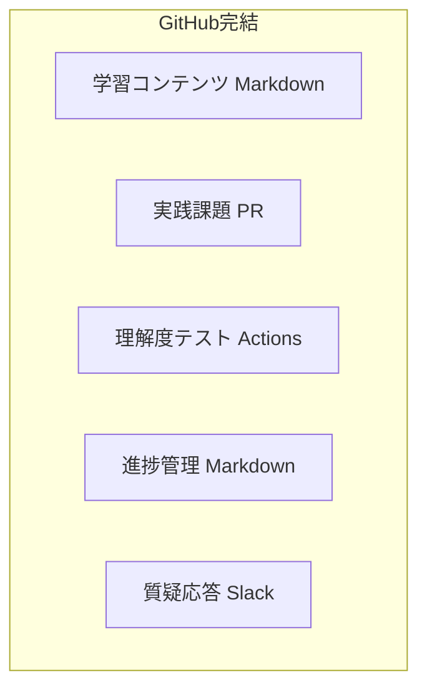
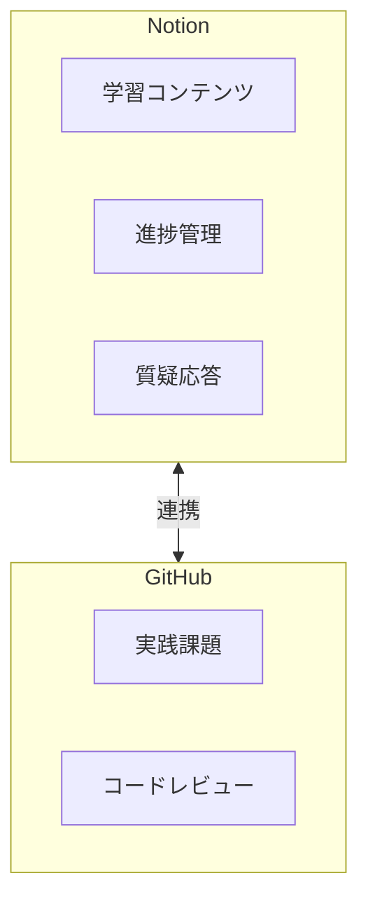
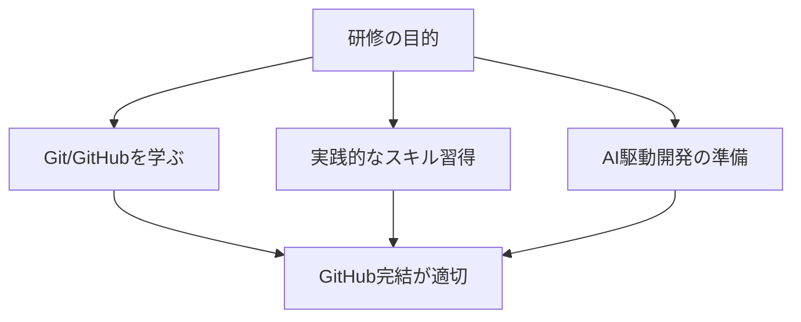
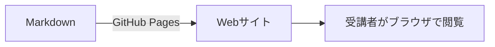
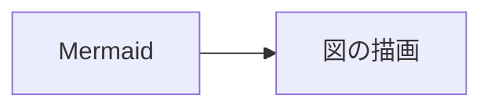
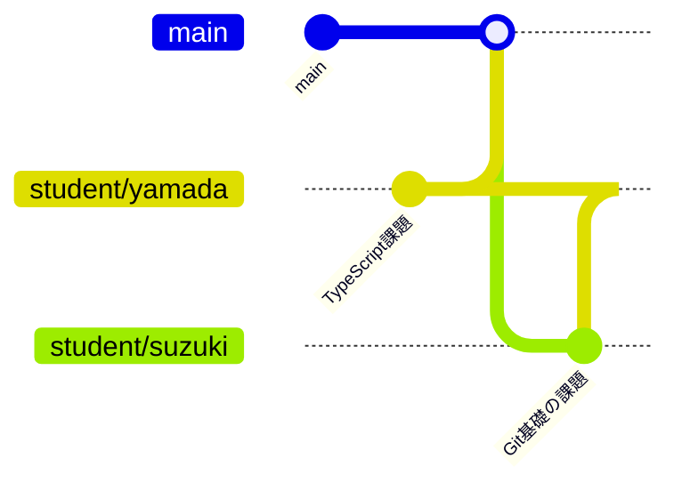

# プラットフォーム選択の比較

> ✅ **決定事項**: 本研修は **GitHub完結** で運用します。

## 1. 概要

本ドキュメントでは、研修プラットフォームとしてGitHub完結とNotion併用を比較した結果、**GitHub完結**を採用しました。以下にその理由を説明します。

## 2. 比較

### 2.1 GitHub完結



#### メリット

| メリット | 説明 |
|----------|------|
| バージョン管理 | Gitでコンテンツの変更履歴を管理 |
| コードとの一元管理 | 学習コンテンツ、実践課題、コードが同じリポジトリ |
| PRによるレビュー | 実践課題の提出もPRで行い、レビューの実践 |
| 自動化 | GitHub Actionsでテスト実行、フィードバック生成 |
| 無料 | プライベートリポジトリでも無料 |
| 実践的スキル | Git/GitHubの使い方が研修の一部に |

#### デメリット

| デメリット | 説明 |
|------------|------|
| Markdownの制約 | リッチなドキュメント作成には限界 |
| 進捗管理の手間 | 視覚的なダッシュボードは作りにくい |
| リアルタイム編集 | 複数人での同時編集が難しい |
| 学習曲線 | Git/GitHubに不慣れな場合の導入コスト |

### 2.2 Notion併用



#### メリット

| メリット | 説明 |
|----------|------|
| リッチなドキュメント | 表、データベース、埋め込みコンテンツ |
| 視覚的な進捗管理 | カンバンボード、ダッシュボード |
| リアルタイム編集 | 複数人での同時編集 |
| テンプレート | 進捗記録、学習ノートのテンプレート |
| 検索機能 | 全文検索が強力 |
| モバイルアプリ | スマホからも簡単にアクセス |

#### デメリット

| デメリット | 説明 |
|------------|------|
| バージョン管理の弱さ | 詳細な変更履歴管理ができない |
| コードとの分離 | コードとドキュメントが別プラットフォーム |
| 自動化の限界 | GitHub Actionsのような自動化ができない |
| コスト | チーム規模によっては有料プランが必要 |
| エクスポートの制約 | データの移行が難しい |

## 3. 推奨：GitHub完結

### 3.1 推奨理由



1. **エンジニア研修の目的に合致**
   - Git/GitHubの使い方を学ぶことが研修の一部
   - 実際の開発現場で使うツールに慣れる

2. **実践的なスキル習得**
   - PRベースの開発フローを実際に体験
   - コードレビューの実践

3. **自動化による効率化**
   - レビューやテストの自動化でメンターの負担軽減
   - 即座のフィードバック

4. **一元管理**
   - コンテンツ、コード、ドキュメントが一箇所に集約
   - 検索や参照が容易

5. **コスト**
   - 無料で利用可能
   - 追加のツール契約が不要

6. **拡張性**
   - 将来的にカスタムツールや自動化を追加しやすい

### 3.2 Notion併用を検討すべきケース

以下の場合は、Notion併用を検討してください：

- **非エンジニアのメンターが多い**: GitHubに不慣れな場合
- **視覚的な進捗管理が特に重要**: 経営層への報告など
- **リッチなドキュメント作成が必須**: インタラクティブなコンテンツが必要

## 4. GitHub完結での補完機能

GitHubでもNotionの利点を一部補完できます：

### 4.1 GitHub Projects

カンバンボード形式の進捗管理が可能です。

```
┌─────────────┬─────────────┬─────────────┐
│  未着手     │  進行中     │  完了       │
├─────────────┼─────────────┼─────────────┤
│ Git基礎     │ TypeScript  │ 環境構築    │
│ 設計基礎    │             │             │
└─────────────┴─────────────┴─────────────┘
```

### 4.2 Slack

質疑応答や議論の場として活用します。

- チャンネル分け
- スレッド機能
- 検索
- リアルタイム性

### 4.3 GitHub Wiki

補足資料やFAQの管理に使用できます。

### 4.4 GitHub Pages（オプション）

学習コンテンツをWebサイトとして公開できます。



### 4.5 Mermaid図表

GitHubのMarkdownはMermaid図表をサポートしています。



## 5. 運用構成

### 5.1 GitHub完結での運用構成

```
1. 学習コンテンツ
   - content/配下のMarkdownファイル
   - GitHub上で直接閲覧・編集可能

2. 実践課題の提出
   - 受講者が個人ブランチを作成
   - exercises/配下に課題を実装
   - プルリクエストで提出
   - GitHub Actionsで自動テスト実行
   - メンターがPRでレビュー

3. 進捗管理
   - progress/students/{student-name}/progress.md
   - 受講者が自己申告で更新
   - メンターが確認・コメント

4. 理解度チェックテスト
   - tests/配下のテストファイル
   - GitHub Actionsで自動採点
   - 結果をprogress.mdに記録

5. 質疑応答
   - Slackを活用
   - チャンネルごとにスレッド作成

6. 成果物管理
   - 応用演習の成果物も同じリポジトリで管理
   - プレゼン資料も含める
```

### 5.2 ブランチ戦略



- `main`: 学習コンテンツ、テンプレート
- `student/{name}`: 受講者ごとのブランチ

## 6. 結論

**GitHub完結を採用**します。

### 採用理由

1. **エンジニア研修の目的に合致** - Git/GitHubの習得自体が研修の一部
2. **自動化による効率化** - メンターの負荷を最小化
3. **実践的なスキル習得** - PRベースの開発フローを体験
4. **無料で利用可能** - 追加のツール契約不要
5. **拡張性が高い** - GitHub Actionsで自動化を追加可能

### 使用するGitHub機能

| 機能 | 用途 | 無料プラン |
|------|------|-----------|
| **Repository** | コンテンツ、コード、ドキュメントの一元管理 | ✅ |
| **Pull Requests** | 課題提出、コードレビュー | ✅ |
| **Actions** | 自動テスト、自動フィードバック、進捗更新 | ✅ 2,000分/月 |
| **Issues** | コンテンツの問題報告、改善提案 | ✅ |
| **Projects** | 進捗の可視化（オプション） | ✅ |

> ⚠️ **注意**: GitHub Discussionsは**プライベートリポジトリでは有料（Team以上）**が必要なため、本研修では使用しません。

### 外部ツールの使用

| ツール | 使用 | 用途 |
|--------|------|------|
| **Slack** | ✅ | 技術的な質問、ナレッジ共有、相談、雑談、緊急連絡 |
| Notion | ❌ | GitHub Markdown + Mermaid で代替 |
| Jira | ❌ | GitHub Issues + Projects で代替 |

**使い分け**:
- **技術的な質問・ナレッジ共有・相談・雑談** → Slack（リアルタイム性、検索可能）
- **コンテンツの問題報告・改善提案** → GitHub Issues（追跡可能）

## 7. 関連ドキュメント

- [レビュー自動化設計](review-automation.md)
- [メンター用運用ガイド](https://github.com/honeycome-bootcamp/bootcamp-v2-mentor/blob/main/docs/mentor-guide.md)（メンター専用リポジトリ）
- [研修生向けガイド](student-guide.md)
