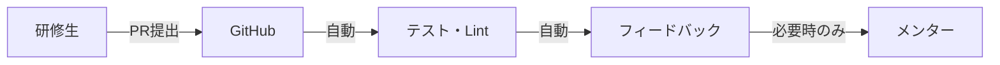
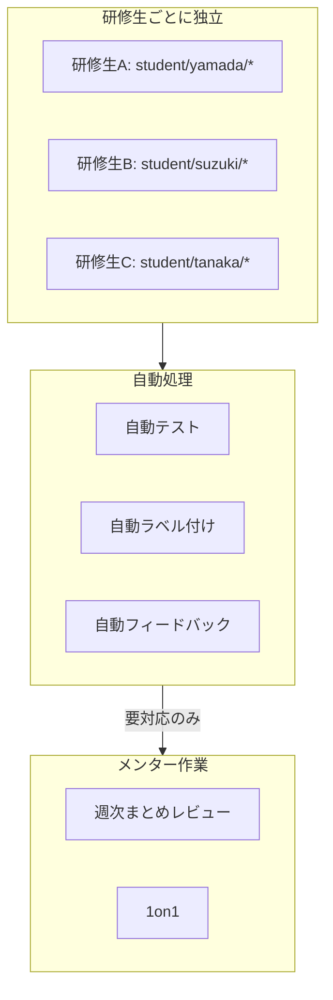
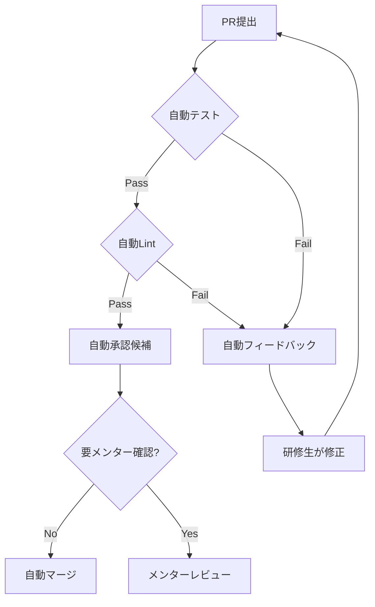
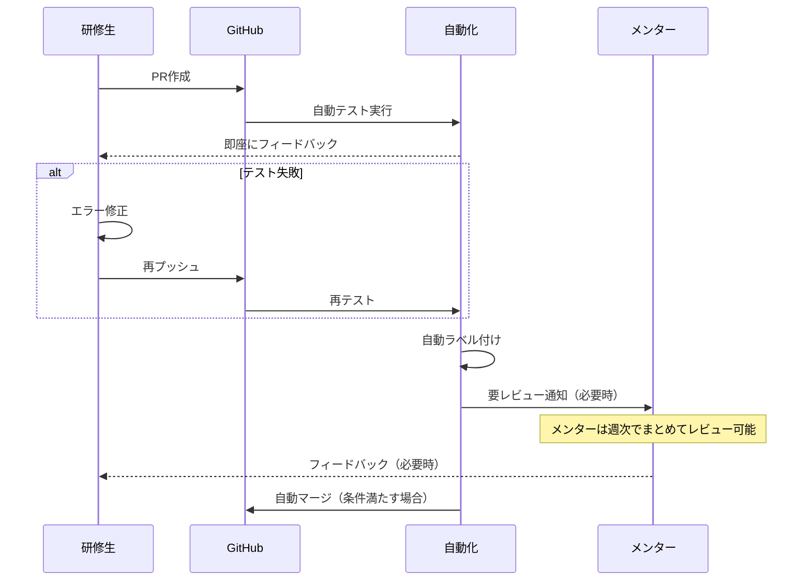

# レビュー自動化設計

## 1. 概要

本ドキュメントでは、メンターの負荷を最小化しつつ、複数の研修生が同時に学習できる自動化の仕組みを説明します。

> ✅ **実装状況**: 本ドキュメントに記載されている自動化機能は全て実装済みです。詳細は[実装状況](implementation-status.md)を参照してください。

### 1.1 設計方針



**原則**: 
- **自動化できることは自動化する**
- メンターは「設計」「アーキテクチャ」「成長支援」に集中
- 複数人同時進行でもスケールする設計

### 1.2 複数人同時対応の仕組み



## 2. ブランチ戦略（複数人対応）

### 2.1 ブランチ命名規則

```
student/{student-name}/{category}/{exercise-name}
```

**例**:
```
student/yamada/common/01-git-basics
student/yamada/common/02-programming-fundamentals
student/suzuki/common/01-git-basics
student/tanaka/web/01-web-fundamentals
```

### 2.2 進捗管理の分離

```
progress/
└── students/
    ├── yamada/
    │   ├── progress.md      # 個人の進捗
    │   └── notes.md         # 学習メモ
    ├── suzuki/
    │   ├── progress.md
    │   └── notes.md
    └── tanaka/
        ├── progress.md
        └── notes.md
```

### 2.3 PRの独立性

- 各研修生のPRは独立して処理される
- マージ先は `main` ではなく研修生個人ブランチ（オプション）
- コンフリクトが発生しない設計

## 3. 自動化の詳細

### 3.1 GitHub Actions ワークフロー一覧

| ワークフロー | トリガー | 処理内容 |
|-------------|----------|----------|
| `exercise-check.yml` | PR作成/更新 | テスト実行、Lint、型チェック |
| `auto-label.yml` | PR作成 | カテゴリに応じたラベル付与 |
| `auto-feedback.yml` | テスト結果 | 自動フィードバックコメント |
| `auto-assign.yml` | PR作成 | レビュアー自動アサイン |
| `progress-update.yml` | PRマージ | 進捗ファイル自動更新 |
| `weekly-report.yml` | 毎週月曜 | 週次進捗レポート生成 |
| `motivation-monitor.yml` | 毎日 9:00 JST | モチベーション・進捗アラート検出 |
| `mentor-daily-checklist.yml` | 毎日 9:00 JST | メンターデイリーチェックリスト生成 |

### 3.2 exercise-check.yml（メイン）

```yaml
name: Exercise Check

on:
  pull_request:
    branches: [main]
    paths:
      - 'exercises/**'

jobs:
  check:
    runs-on: ubuntu-latest
    steps:
      - uses: actions/checkout@v4
      
      - name: Setup Node.js
        uses: actions/setup-node@v4
        with:
          node-version: '20'
          cache: 'npm'
          
      - name: Install dependencies
        run: npm ci
        
      - name: Get changed files
        id: changed
        uses: tj-actions/changed-files@v40
        with:
          files: exercises/**
          
      - name: Run tests for changed exercises
        run: |
          for file in ${{ steps.changed.outputs.all_changed_files }}; do
            exercise_dir=$(dirname "$file")
            if [ -f "$exercise_dir/package.json" ]; then
              cd "$exercise_dir"
              npm test
              cd -
            fi
          done
          
      - name: Run ESLint
        run: npm run lint -- --format json --output-file eslint-report.json
        continue-on-error: true
        
      - name: Run TypeScript check
        run: npm run type-check
        continue-on-error: true
        
      - name: Post results comment
        uses: actions/github-script@v7
        with:
          script: |
            const fs = require('fs');
            let comment = '## 🤖 自動チェック結果\n\n';
            
            // テスト結果
            comment += '### テスト\n';
            comment += '${{ job.status }}' === 'success' 
              ? '✅ すべてのテストが通過しました\n' 
              : '❌ テストが失敗しました。エラーを確認してください\n';
            
            // ESLint結果
            if (fs.existsSync('eslint-report.json')) {
              const report = JSON.parse(fs.readFileSync('eslint-report.json'));
              const errors = report.reduce((sum, file) => sum + file.errorCount, 0);
              const warnings = report.reduce((sum, file) => sum + file.warningCount, 0);
              comment += `\n### Lint\n`;
              comment += errors === 0 
                ? '✅ Lintエラーなし\n' 
                : `❌ ${errors}件のエラー、${warnings}件の警告\n`;
            }
            
            comment += '\n---\n';
            comment += '質問があれば [Discussions](../discussions) で聞いてください！';
            
            github.rest.issues.createComment({
              issue_number: context.issue.number,
              owner: context.repo.owner,
              repo: context.repo.repo,
              body: comment
            });
```

### 3.3 auto-label.yml

```yaml
name: Auto Label

on:
  pull_request:
    types: [opened]

jobs:
  label:
    runs-on: ubuntu-latest
    steps:
      - name: Add labels based on path
        uses: actions/github-script@v7
        with:
          script: |
            const { owner, repo } = context.repo;
            const prNumber = context.payload.pull_request.number;
            const files = await github.rest.pulls.listFiles({
              owner, repo, pull_number: prNumber
            });
            
            const labels = new Set();
            
            for (const file of files.data) {
              if (file.filename.startsWith('exercises/common/')) {
                labels.add('共通基礎');
                const match = file.filename.match(/exercises\/common\/(\d+-[^/]+)/);
                if (match) labels.add(match[1]);
              }
              if (file.filename.startsWith('exercises/web/')) labels.add('Webコース');
              if (file.filename.startsWith('exercises/mobile/')) labels.add('モバイルコース');
              if (file.filename.startsWith('exercises/iot/')) labels.add('IoTコース');
            }
            
            // 研修生名を抽出
            const branch = context.payload.pull_request.head.ref;
            const studentMatch = branch.match(/student\/([^/]+)/);
            if (studentMatch) {
              labels.add(`student:${studentMatch[1]}`);
            }
            
            if (labels.size > 0) {
              await github.rest.issues.addLabels({
                owner, repo,
                issue_number: prNumber,
                labels: Array.from(labels)
              });
            }
```

### 3.4 auto-feedback.yml

```yaml
name: Auto Feedback

on:
  workflow_run:
    workflows: ["Exercise Check"]
    types: [completed]

jobs:
  feedback:
    runs-on: ubuntu-latest
    if: ${{ github.event.workflow_run.conclusion == 'failure' }}
    steps:
      - name: Generate helpful feedback
        uses: actions/github-script@v7
        with:
          script: |
            // 失敗時の自動フィードバック
            const comment = `## 💡 ヒント

テストが失敗しています。以下を確認してみてください：

1. **エラーメッセージを読む** - 何が間違っているか具体的に書いてあります
2. **コンテンツを見直す** - 該当するカテゴリのREADMEを再確認
3. **型エラー** - TypeScriptの型が正しいか確認

それでも解決しない場合は、[Discussions](../../discussions) で質問してください！

<details>
<summary>質問テンプレート</summary>

\`\`\`markdown
## 状況
何をしようとしていますか？

## 試したこと
どんな方法を試しましたか？

## エラー内容
（GitHub Actionsのログを貼り付け）
\`\`\`

</details>
`;
            
            // PRにコメント
            // ...
```

### 3.5 progress-update.yml（進捗自動更新）

```yaml
name: Progress Update

on:
  pull_request:
    types: [closed]
    branches: [main]

jobs:
  update-progress:
    if: github.event.pull_request.merged == true
    runs-on: ubuntu-latest
    steps:
      - uses: actions/checkout@v4
        with:
          token: ${{ secrets.GITHUB_TOKEN }}
          
      - name: Update progress file
        uses: actions/github-script@v7
        with:
          script: |
            const fs = require('fs');
            const branch = context.payload.pull_request.head.ref;
            
            // ブランチ名から研修生とカテゴリを抽出
            const match = branch.match(/student\/([^/]+)\/([^/]+)\/(.+)/);
            if (!match) return;
            
            const [, student, course, category] = match;
            const progressPath = `progress/students/${student}/progress.md`;
            
            // 進捗ファイルを更新
            let content = fs.readFileSync(progressPath, 'utf8');
            const today = new Date().toISOString().split('T')[0];
            
            // カテゴリの状態を完了に更新
            content = content.replace(
              new RegExp(`\\| ${category} \\| .+ \\|`),
              `| ${category} | ✅ 完了 | - | ${today} | - |`
            );
            
            fs.writeFileSync(progressPath, content);
            
      - name: Commit progress update
        run: |
          git config user.name "github-actions[bot]"
          git config user.email "github-actions[bot]@users.noreply.github.com"
          git add progress/
          git commit -m "chore: 進捗を自動更新" || exit 0
          git push
```

### 3.6 weekly-report.yml（週次レポート）

```yaml
name: Weekly Report

on:
  schedule:
    - cron: '0 0 * * 1'  # 毎週月曜 9:00 JST
  workflow_dispatch:

jobs:
  report:
    runs-on: ubuntu-latest
    steps:
      - uses: actions/checkout@v4
      
      - name: Generate weekly report
        uses: actions/github-script@v7
        with:
          script: |
            const fs = require('fs');
            const path = require('path');
            
            // 各研修生の進捗を集計
            const studentsDir = 'progress/students';
            const students = fs.readdirSync(studentsDir);
            
            let report = '# 週次進捗レポート\n\n';
            report += `生成日時: ${new Date().toISOString()}\n\n`;
            
            for (const student of students) {
              const progressPath = path.join(studentsDir, student, 'progress.md');
              if (!fs.existsSync(progressPath)) continue;
              
              const content = fs.readFileSync(progressPath, 'utf8');
              const completed = (content.match(/✅/g) || []).length;
              const inProgress = (content.match(/🔄/g) || []).length;
              
              report += `## ${student}\n`;
              report += `- 完了: ${completed}\n`;
              report += `- 進行中: ${inProgress}\n\n`;
            }
            
            // Discussionに投稿
            await github.rest.discussions.create({
              owner: context.repo.owner,
              repo: context.repo.repo,
              title: `週次進捗レポート - ${new Date().toLocaleDateString('ja-JP')}`,
              body: report,
              category_id: 'announcements'
            });
```

## 4. 自動フィードバックの内容

### 4.1 テスト結果に応じたフィードバック

| 状況 | 自動コメント |
|------|-------------|
| 全テスト通過 | ✅ 素晴らしい！メンターレビューをお待ちください |
| 一部失敗 | 💡 ヒントを表示、該当コンテンツへのリンク |
| Lint エラー | 📝 具体的な修正箇所を表示 |
| 型エラー | 🔧 TypeScriptの型に関するヒント |

### 4.2 よくあるエラーの自動検出と提案

```yaml
# 自動検出パターン
patterns:
  - name: "エラーハンドリング漏れ"
    regex: "fetch\\([^)]+\\)\\s*;\\s*(?!.*\\.ok)"
    suggestion: "fetchの結果はresponse.okをチェックしてください"
    
  - name: "any型の使用"
    regex: ": any"
    suggestion: "any型の使用は避け、具体的な型を指定してください"
    
  - name: "console.logの残留"
    regex: "console\\.log"
    suggestion: "デバッグ用のconsole.logは削除してください"
```

## 5. メンターの作業削減

### 5.1 メンターが対応する範囲



### 5.2 自動承認の条件

以下のすべてを満たす場合、メンターレビューなしで承認可能：

- [ ] すべてのテストが通過
- [ ] Lintエラーなし
- [ ] 型エラーなし
- [ ] コードカバレッジ80%以上
- [ ] 初回提出から3回以内

### 5.3 メンターが確認すべき項目

自動化できない部分のみメンターが確認：

| 項目 | 確認ポイント |
|------|-------------|
| 設計 | アーキテクチャ、責務の分離 |
| 可読性 | 命名、コメント、構造化 |
| セキュリティ | 自動検出できない脆弱性 |
| 成長 | 前回からの改善点 |

### 5.4 レビュー時間の目安

| カテゴリ | 自動チェック後の目安 |
|----------|---------------------|
| 基礎課題 | 5-10分 |
| 中級課題 | 10-15分 |
| 応用演習 | 30分-1時間 |

## 6. 運用フロー

### 6.1 研修生の1日



### 6.2 メンターの1週間

| 曜日 | 作業 | 時間 |
|------|------|------|
| 月 | 週次レポート確認、週の計画 | 30分 |
| 火-木 | 要対応PRのレビュー（通知されたもののみ） | 各15-30分 |
| 金 | 1on1、振り返り | 各30分×人数 |

## 7. 関連ドキュメント

- [メンター用運用ガイド](https://github.com/honeycome-bootcamp/bootcamp-v2-mentor/blob/main/docs/mentor-guide.md)（メンター専用リポジトリ）
- [研修生向けガイド](student-guide.md)
- [コンテンツ改善ガイド](contributing.md)
