# 研修生向けガイド

## 🚀 クイックスタート（最初に読んでください）

> 📌 **重要**: このガイドを最初から最後まで読んでから、学習を開始してください。自動化システムの仕組みを理解することで、スムーズに学習を進められます。

研修を始めるために、以下の4ステップを完了してください。

### Step 1: 環境構築（所要時間：30分〜1時間）

以下のツールをインストールしてください：

| ツール | バージョン | インストール方法 | 費用 |
|--------|-----------|------------------|------|
| Git | 最新版 | [git-scm.com](https://git-scm.com/) | 無料 |
| Node.js | v18以上 | [nodejs.org](https://nodejs.org/) | 無料 |
| Cursor | 最新版 | [cursor.sh](https://cursor.sh/) | 無料* |
| Docker | 最新版 | [docker.com](https://www.docker.com/) | 無料* |

> *Cursorは無料プランで十分です。Docker Desktopは個人・教育用途は無料です。

インストール確認：
```bash
git --version    # git version 2.x.x
node --version   # v18.x.x以上
docker --version # Docker version 2x.x.x
```

### Step 2: リポジトリのクローン

```bash
git clone https://github.com/honeycome-bootcamp/bootcamp-v2.git
cd bootcamp-v2
```

### Step 3: 進捗管理フォルダの作成

`{your-name}` をあなたの名前（ローマ字）に置き換えてください：

```bash
mkdir -p progress/students/{your-name}
cp progress/templates/progress-template.md progress/students/{your-name}/progress.md
```

> 💡 **重要**: 進捗ファイルは毎日更新してください。モチベーション監視システムが自動で分析し、必要に応じてメンターにアラートを送ります。

### Step 4: 学習開始

準備が完了したら、以下のコンテンツから学習を開始してください：

📁 **最初のコンテンツ**: [content/common/00-engineer-mindset/README.md](../content/common/00-engineer-mindset/README.md)

> 📌 **旧バージョン（v1）を受講済みの方へ**: 差分のみを効率的に学習できるガイドがあります。
> → [旧コンテンツ受講者向け差分学習ガイド](migration-guide-v1-to-v2.md)

---

## 🎯 あなたに合った学習パス

研修を効率的に進めるために、まずあなたのレベルを確認しましょう。

### レベル診断チェックリスト

以下の質問に答えて、自分のレベルを確認してください。

#### プログラミング経験

| 質問 | はい | いいえ |
|------|------|--------|
| プログラミング言語を1つ以上使ったことがある | □ | □ |
| 変数、関数、条件分岐、ループを理解している | □ | □ |
| オブジェクト指向プログラミングの概念を知っている | □ | □ |
| 何かしらのアプリケーションを作ったことがある | □ | □ |

#### 開発ツール経験

| 質問 | はい | いいえ |
|------|------|--------|
| Gitの基本操作（clone, commit, push）ができる | □ | □ |
| GitHubでプルリクエストを作成したことがある | □ | □ |
| ターミナル/コマンドラインを使ったことがある | □ | □ |
| Docker を使ったことがある | □ | □ |

#### 判定結果

| 「はい」の数 | レベル | おすすめパス |
|-------------|--------|-------------|
| 0-2個 | **初心者** | 🌱 [初心者向けパス](#初心者向けパス) |
| 3-5個 | **基礎あり** | 🌿 [基礎経験者向けパス](#基礎経験者向けパス) |
| 6-8個 | **経験者** | 🌳 [経験者向けパス](#経験者向けパス) |

---

### 🌱 初心者向けパス

プログラミング未経験、または経験が浅い方向けの学習パスです。

#### 特徴

- **すべてのコンテンツを順番に学習**
- **[基礎]マーカーのコンテンツを重点的に**
- **手を動かしながら、じっくり進める**

#### 学習の進め方

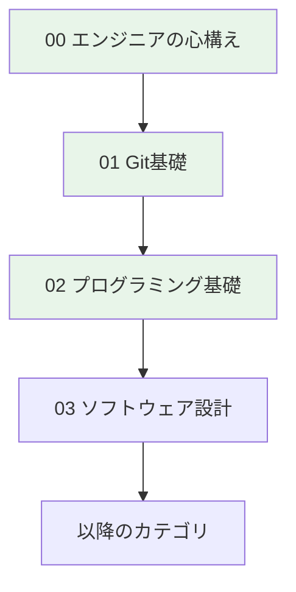

#### カテゴリ別のポイント

| カテゴリ | 初心者へのアドバイス | 時間配分 |
|----------|---------------------|----------|
| **00 エンジニアの心構え** | 全部読む。報連相は特に重要 | 1日 |
| **01 Git基礎** | 全コンテンツをしっかり学習。実際に手を動かす | 2日 |
| **02 プログラミング基礎** | **最重要**。わからなければ何度も読み返す | 4-5日 |
| **03 ソフトウェア設計** | 最初は難しく感じるが、設計パターンは暗記しなくてOK | 3日 |
| **04 データベース基礎** | SQLを実際に書いて試す | 3日 |
| **05 テストと品質** | テストを書く習慣を身につける | 3日 |
| **06 セキュリティ基礎** | 「なぜ危険か」を理解する | 2日 |
| **07 インフラ基礎** | Dockerは実際に動かして体験 | 3日 |
| **08 CI/CD基礎** | GitHub Actionsを実際に設定してみる | 2日 |
| **09 AI駆動開発** | AIに頼りすぎない。基礎を理解した上で活用 | 3日 |
| **10 仕様駆動開発** | 仕様を書く練習をする | 2日 |

#### 想定期間

- **共通基礎**: 3-4週間
- **コース別**: 3-4週間
- **合計**: 約2ヶ月

#### 注意点

- ⚠️ **わからないまま進まない** - 30分悩んだら質問
- ⚠️ **コピペだけで終わらない** - 理解してから次へ
- ⚠️ **焦らない** - 基礎をしっかり身につけることが大事

---

### 🌿 基礎経験者向けパス

プログラミングの基礎はあるが、実務経験が少ない方向けの学習パスです。

#### 特徴

- **理解度チェックテストを先に解いて、弱点を把握**
- **[基礎]は確認程度、[中級]を重点的に**
- **既に知っている部分は効率よくスキップ**

#### 学習の進め方

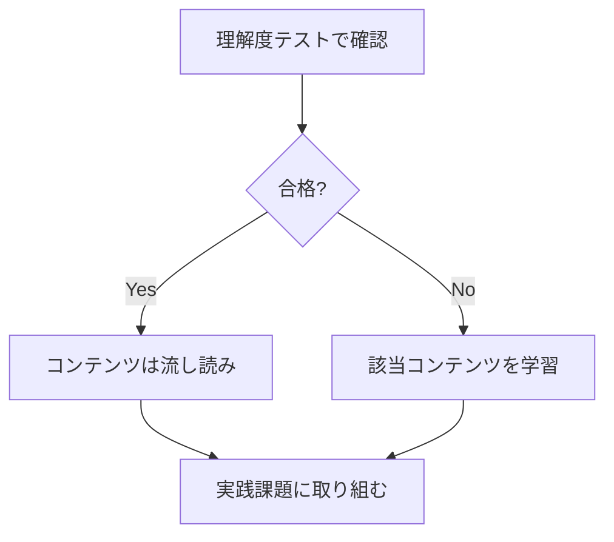

#### カテゴリ別のポイント

| カテゴリ | 基礎経験者へのアドバイス | スキップ可否 |
|----------|------------------------|-------------|
| **00 エンジニアの心構え** | 流し読みでOK。報連相のセクションは確認 | △ 確認のみ |
| **01 Git基礎** | テストを先に解く。知っていれば確認程度 | △ テストで判断 |
| **02 プログラミング基礎** | TypeScript特有の型システムを重点的に | △ 一部スキップ可 |
| **03 ソフトウェア設計** | SOLID原則、設計パターンを復習 | ✗ しっかり学習 |
| **04 データベース基礎** | トランザクション、正規化を重点的に | △ 一部スキップ可 |
| **05 テストと品質** | TDDを実践できるレベルまで | ✗ しっかり学習 |
| **06 セキュリティ基礎** | OWASP Top 10は必ず理解 | ✗ しっかり学習 |
| **07 インフラ基礎** | Dockerを使ったことがあれば確認程度 | △ テストで判断 |
| **08 CI/CD基礎** | GitHub Actionsの実践を重点的に | △ 一部スキップ可 |
| **09 AI駆動開発** | **新規コンテンツ**。必ず学習 | ✗ 必須 |
| **10 仕様駆動開発** | **新規コンテンツ**。必ず学習 | ✗ 必須 |

**凡例**: ✗ スキップ不可 / △ 条件付きスキップ可 / ○ スキップ可

#### 想定期間

- **共通基礎**: 2-3週間
- **コース別**: 2-3週間
- **合計**: 約1-1.5ヶ月

---

### 🌳 経験者向けパス

実務経験があり、基礎的な開発スキルを持っている方向けの学習パスです。

> ⚠️ **重要**: AI駆動開発を許可される前に、前提条件コースを完了する必要があります。
> → [経験エンジニア向け AI駆動開発前提条件コース](experienced-engineer-prerequisites.md)

#### 特徴

- **理解度チェックテストで実力を確認**
- **弱点のみを重点的に学習**
- **新規コンテンツ（AI駆動開発、仕様駆動開発）に集中**
- **AI駆動開発許可前の前提条件確認**

#### 学習の進め方

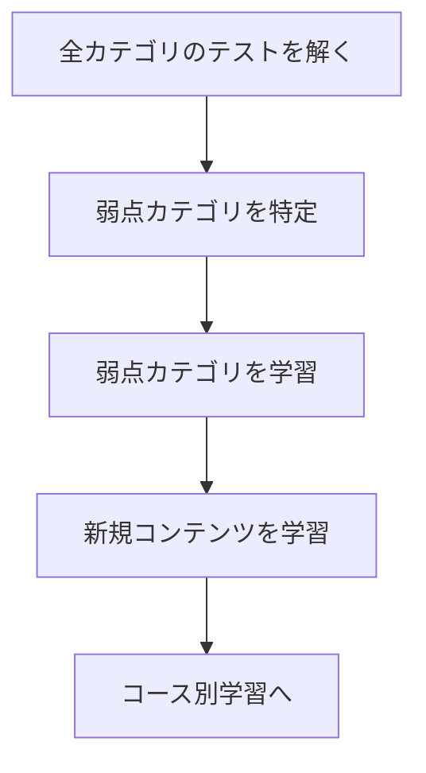

#### カテゴリ別のポイント

| カテゴリ | 経験者へのアドバイス | 推奨アクション |
|----------|---------------------|---------------|
| **00 エンジニアの心構え** | 経験があっても報連相は確認 | テストのみ |
| **01 Git基礎** | 日常的に使っているならスキップ | テストで確認 |
| **02 プログラミング基礎** | TypeScript経験がなければ型システムを確認 | 型システムのみ |
| **03 ソフトウェア設計** | 設計原則を言語化できるか確認 | テストで確認 |
| **04 データベース基礎** | 実務で使っているならスキップ | テストで確認 |
| **05 テストと品質** | TDDを実践できているか確認 | 弱点のみ |
| **06 セキュリティ基礎** | 見落としがちなので確認推奨 | 一通り確認 |
| **07 インフラ基礎** | Docker経験があればスキップ | テストで確認 |
| **08 CI/CD基礎** | GitHub Actions経験があれば確認程度 | テストで確認 |
| **09 AI駆動開発** | **必須**。体系的に学ぶ | 全コンテンツ |
| **10 仕様駆動開発** | **必須**。仕様書の書き方を習得 | 全コンテンツ |

#### 効率的な学習方法

1. **前提条件コースを完了**（[経験エンジニア向け AI駆動開発前提条件コース](experienced-engineer-prerequisites.md)）
   - 全カテゴリ（01-08）の理解度テストを実施
   - 不合格カテゴリを学習
   - AI駆動開発許可を取得
2. **新規コンテンツ（09, 10）を学習**（2-4日）
3. **コース別学習へ進む**

#### 想定期間

- **共通基礎**: 1-2週間
- **コース別**: 2-3週間
- **合計**: 約1ヶ月

---

### レベル別 期間比較

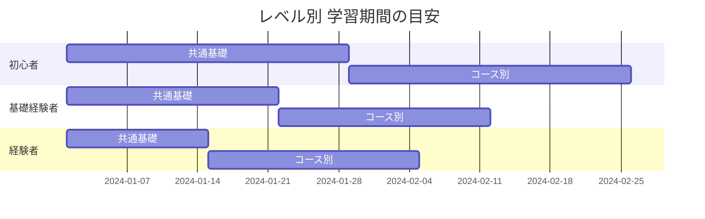

| レベル | 共通基礎 | コース別 | 合計 |
|--------|----------|----------|------|
| 初心者 | 3-4週間 | 3-4週間 | 約2ヶ月 |
| 基礎経験者 | 2-3週間 | 2-3週間 | 約1-1.5ヶ月 |
| 経験者 | 1-2週間 | 2-3週間 | 約1ヶ月 |

---

## 📋 目次

1. [研修の全体像](#1-研修の全体像)
2. [研修の目的](#2-研修の目的)
3. [学習内容の詳細](#3-学習内容の詳細)
4. [1日の学習の進め方](#4-1日の学習の進め方)
5. [課題の提出方法](#5-課題の提出方法)
6. [困ったときは](#6-困ったときは)
7. [よくある質問](#7-よくある質問)

---

## 1. 研修の全体像

### 1.1 研修のロードマップ

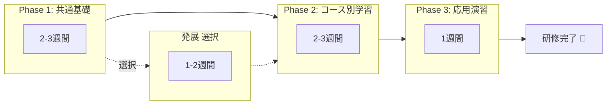

| フェーズ | 期間 | 内容 | 成果物 | 必須/選択 |
|----------|------|------|--------|----------|
| **Phase 1** | 2-3週間 | 共通基礎（全員共通） | 各カテゴリの実践課題 | **必須** |
| **発展** | 1-2週間 | コンテナ発展、IaC等 | - | 選択 |
| **Phase 2** | 2-3週間 | コース別学習 | 各カテゴリの実践課題 | **必須** |
| **Phase 3** | 1週間 | 応用演習 | **動作するアプリケーション** | **必須** |

**合計期間**: 
- **最短**: 約1〜1.5ヶ月（発展カテゴリなし）
- **標準**: 約1.5〜2ヶ月（発展カテゴリ一部）
- **フル**: 約2ヶ月（発展カテゴリ全部）

### 1.2 コースの選択

研修開始時に、以下の3つのコースから1つを選択します。

| コース | こんな人におすすめ | 作る成果物 |
|--------|-------------------|-----------|
| **Webエンジニア** | Webサービスを作りたい | フルスタックWebアプリ |
| **iOS/Androidアプリ** | スマホアプリを作りたい | モバイルアプリ |
| **IoTエンジニア** | ハードウェア連携に興味がある | IoTシステム |

> 💡 **迷ったら**: Webエンジニアコースがおすすめです。Webの知識は他のコースでも活用できます。

### 1.3 学習の流れ（各カテゴリ）

各カテゴリは以下の流れで学習します：

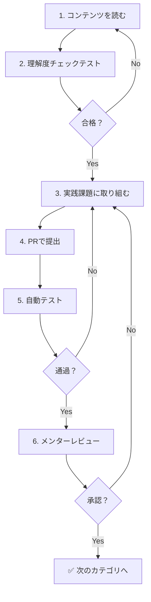

| ステップ | やること | 所要時間目安 | 場所 |
|----------|----------|-------------|------|
| 1. コンテンツを読む | READMEと各コンテンツを読む | 1-2時間 | `content/[コース]/[カテゴリ]/` |
| 2. 理解度テスト | テストに回答（読めば解ける） | 15-30分 | `tests/[コース]/[カテゴリ]/` または `content/.../quiz.md` |
| 3. 実践課題 | コードを書いて課題に取り組む | 2-4時間 | `exercises/[コース]/[カテゴリ]/` |
| 4. PR提出 | GitHubにプルリクエストを作成 | 15分 | GitHub |
| 5. 自動テスト | 自動で実行される（待つだけ） | 5分 | GitHub Actions |
| 6. レビュー | メンターのフィードバックを反映 | 30分-1時間 | GitHub PR |

---

## 2. 研修の目的

### 2.1 なぜ今、基礎力が重要なのか

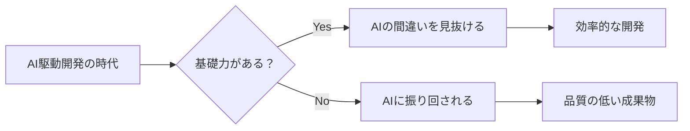

GitHub Copilot、Cursor、ChatGPT等のAIツールが普及しています。
AIは便利ですが、**時に誤ったコードを生成します**。

#### AIの間違いの例

```typescript
// ❌ AIが生成したコード（一見正しそうだが問題あり）
async function fetchUserData(userId: string) {
  const response = await fetch(`/api/users/${userId}`);
  return response.json(); // エラーハンドリングがない！
}

// ✅ 正しいコード
async function fetchUserData(userId: string) {
  const response = await fetch(`/api/users/${userId}`);
  if (!response.ok) {
    throw new Error(`Failed to fetch user: ${response.status}`);
  }
  return response.json();
}
```

**基礎力があれば、このような間違いを見抜けます。**

### 2.2 この研修で身につけること

| 身につけること | 具体的な内容 |
|----------------|-------------|
| **基礎力** | プログラミング、設計、テスト、セキュリティの基礎 |
| **開発フロー** | 要件定義→設計→実装→テスト→デプロイの流れ |
| **AIとの協働** | AIの活用方法と、AIの間違いを見抜く力 |
| **実践力** | 実際に動くアプリケーションを作る経験 |

### 2.3 研修終了時のゴール

研修終了時には、以下ができるようになります：

- ✅ 基本的なアプリケーションを設計・実装できる
- ✅ テストを書ける
- ✅ デプロイ・運用ができる
- ✅ Gitを使った協働開発ができる
- ✅ コードレビューができる
- ✅ AIの出力が正しいか判断できる

---

## 3. 学習内容の詳細

### 3.1 Phase 1: 共通基礎（全員共通、2-3週間）

すべてのコースで共通して学ぶ基礎知識です。**この順番で学習してください。**

| No | カテゴリ | 学ぶこと | 日数 | コンテンツ |
|----|----------|----------|------|-----------|
| 00 | **エンジニアの心構え** | 報連相、目的思考、継続学習 | 1日 | [📁 開く](../content/common/00-engineer-mindset/) |
| 01 | **Git基礎** | バージョン管理、GitHub、PR | 1-2日 | [📁 開く](../content/common/01-git-basics/) |
| 02 | **プログラミング基礎** | TypeScript、型、オブジェクト指向 | 3-4日 | [📁 開く](../content/common/02-programming-fundamentals/) |
| 03 | **ソフトウェア設計** | SOLID原則、設計パターン | 2-3日 | [📁 開く](../content/common/03-software-design/) |
| 04 | **データベース基礎** | SQL、設計、トランザクション | 2-3日 | [📁 開く](../content/common/04-database-basics/) |
| 05 | **テストと品質** | 単体テスト、TDD | 2-3日 | [📁 開く](../content/common/05-testing-quality/) |
| 06 | **セキュリティ基礎** | OWASP Top 10、認証・認可 | 1-2日 | [📁 開く](../content/common/06-security-basics/) |
| 07 | **インフラ基礎** | サーバー、クラウド、Docker | 2-3日 | [📁 開く](../content/common/07-infrastructure-basics/) |
| 08 | **CI/CD基礎** | GitHub Actions、自動デプロイ | 1-2日 | [📁 開く](../content/common/08-ci-cd-basics/) |
| 09 | **AI駆動開発** | Cursor、プロンプト、AIと協働 | 2-3日 | [📁 開く](../content/common/09-ai-driven-development/) |
| 10 | **仕様駆動開発** | 仕様書、要件定義 | 1-2日 | [📁 開く](../content/common/10-spec-driven-development/) |

> 💡 各カテゴリのフォルダには`README.md`があります。まずそれを読んでください。

### 3.2 発展カテゴリ【選択】（1-2週間）

> ⚠️ **以下のカテゴリは選択コンテンツです。** 必須ではありませんが、DevOps/インフラに興味がある方や、実務で必要になる方におすすめです。

| No | カテゴリ | こんな人におすすめ | 日数 | コンテンツ |
|----|----------|-------------------|------|-----------|
| 11 | **コンテナ発展** | Docker Composeを使いたい | 3-4日 | [📁 開く](../content/common/11-container-advanced/) |
| 12 | **IaC入門（AWS CDK）** | TypeScriptでインフラ管理したい | 2-3日 | [📁 開く](../content/common/12-iac-basics/) |
| 13 | **クラウド実践** | AWS/ECSを学びたい | 3-4日 | [📁 開く](../content/common/13-cloud-practice/) |
| 14 | **監視と運用** | 本番運用を学びたい | 2-3日 | [📁 開く](../content/common/14-monitoring-operations/) |

**学習パターン**:
- **最短コース**: 発展カテゴリをスキップ → Phase 2へ
- **標準コース**: 興味のある発展カテゴリを1-2個選択
- **フルコース**: 発展カテゴリをすべて学習（期間+1-2週間）

> 💡 **迷ったら**: まずはPhase 2に進み、コース別学習を完了した後に発展カテゴリに戻ることもできます。

### 3.3 Phase 2: コース別学習（2-3週間）

#### 🌐 Webエンジニアコース

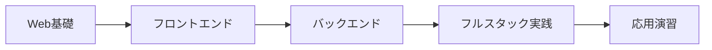

| No | カテゴリ | 学ぶこと | 日数 | コンテンツ |
|----|----------|----------|------|-----------|
| 01 | **Web基礎** | HTTP、HTML/CSS | 2-3日 | [📁 開く](../content/web/01-web-fundamentals/) |
| 02 | **フロントエンド** | React/Next.js、状態管理 | 4-5日 | [📁 開く](../content/web/02-frontend-development/) |
| 03 | **バックエンド** | Node.js、Express、API | 4-5日 | [📁 開く](../content/web/03-backend-development/) |
| 04 | **フルスタック実践** | 連携、認証フロー | 3-4日 | [📁 開く](../content/web/04-fullstack-practice/) |
| 05 | **応用演習** | Webアプリ開発 | 5-7日 | [📁 開く](../content/web/05-capstone-project/) |

**成果物**: フルスタックWebアプリケーション（デプロイ済み）

#### 📱 iOS/Androidアプリエンジニアコース

| No | カテゴリ | 学ぶこと | 日数 | コンテンツ |
|----|----------|----------|------|-----------|
| 01 | **モバイル基礎** | アプリの特徴、UI/UX | 1-2日 | [📁 開く](../content/mobile/01-mobile-fundamentals/) |
| 02 | **iOS開発** | Swift、SwiftUI | 3-4日 | [📁 開く](../content/mobile/02-ios-development/) |
| 03 | **Android開発** | Kotlin、Compose | 3-4日 | [📁 開く](../content/mobile/03-android-development/) |
| 04 | **クロスプラットフォーム** | React Native | 2-3日 | [📁 開く](../content/mobile/04-cross-platform/) |
| 05 | **応用演習** | アプリ開発 | 3-5日 | [📁 開く](../content/mobile/05-capstone-project/) |

**成果物**: モバイルアプリ（ストア公開準備完了）

#### 🔌 IoTエンジニアコース

| No | カテゴリ | 学ぶこと | 日数 | コンテンツ |
|----|----------|----------|------|-----------|
| 01 | **IoT基礎** | ハードウェア基礎 | 2-3日 | [📁 開く](../content/iot/01-iot-fundamentals/) |
| 02 | **組み込みシステム** | C/C++、Node.js | 4-5日 | [📁 開く](../content/iot/02-embedded-systems/) |
| 03 | **IoTプロトコル** | MQTT、無線通信 | 2-3日 | [📁 開く](../content/iot/03-iot-protocols/) |
| 04 | **クラウド連携** | AWS IoT | 3-4日 | [📁 開く](../content/iot/04-iot-cloud-integration/) |
| 05 | **応用演習** | IoTシステム開発 | 5-7日 | [📁 開く](../content/iot/05-capstone-project/) |

**成果物**: 動作するIoTシステム

### 3.4 難易度マーカー

コンテンツには難易度マーカーが付いています。

| マーカー | 対象 | 説明 |
|----------|------|------|
| **[基礎]** | 初心者 | 必ず学習してください |
| **[中級]** | 経験者 | 基礎がある前提で進めます |
| **[応用]** | 発展 | スキップ可能、余裕があれば |

---

## 4. 1日の学習の進め方

### 4.1 推奨スケジュール

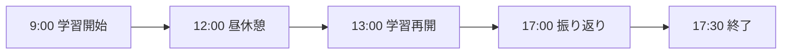

| 時間 | 活動 | 内容 |
|------|------|------|
| 9:00-12:00 | **インプット** | コンテンツを読む、理解度テスト |
| 12:00-13:00 | 昼休憩 | - |
| 13:00-16:30 | **アウトプット** | 実践課題に取り組む |
| 16:30-17:00 | **振り返り** | 学んだことをメモ、進捗更新 |
| 17:00-17:30 | **質問・PR** | わからないことを整理、PRを作成 |

### 4.2 1つのカテゴリの学習手順

#### Day 1: インプット

```
1. 📖 README.mdを読む（カテゴリの概要を把握）
2. 📖 各コンテンツを順番に読む
3. 📝 わからないところをメモ
4. ✅ 理解度チェックテストに挑戦
```

#### Day 2以降: アウトプット

```
1. 📖 content/内のexercises/で課題の説明を確認
2. 📁 exercises/配下で課題に取り組む（コードを書く）
3. 🧪 理解度チェックテストを実行（tests/配下）
4. 🔄 テストを実行して確認
5. 📤 PRを作成して提出
6. 👀 レビューを受けて修正
```

> 💡 **注意**: 
> - 課題の説明: `content/[コース]/[カテゴリ]/exercises/`
> - 成果物の提出先: `exercises/[コース]/[カテゴリ]/`
> - 理解度チェックテスト: `tests/[コース]/[カテゴリ]/` または `content/[コース]/[カテゴリ]/quiz.md`

### 4.3 学習のコツ

#### ✅ やるべきこと

| コツ | 理由 |
|------|------|
| **手を動かす** | 読むだけでは身につかない |
| **エラーを読む** | エラーメッセージは解決のヒント |
| **調べる習慣** | 公式ドキュメントを読む癖をつける |
| **質問する** | 悩んでも30分以内に質問 |
| **振り返る** | 学んだことを言語化する |

#### ❌ やってはいけないこと

| NG | 理由 |
|----|------|
| コピペだけで終わる | 理解せずに進んでも身につかない |
| わからないまま放置 | 後で積み重なって辛くなる |
| 1日中悩む | 時間の無駄、早めに質問 |

---

## 5. 課題の提出方法

### 5.1 提出の流れ（自動化システム）

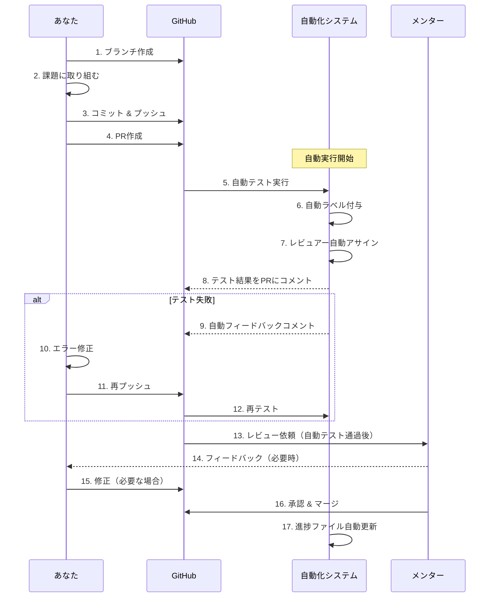

> ✅ **自動化のメリット**: 
> - PR作成後、自動でテスト・Lint・型チェックが実行されます
> - テスト失敗時は自動でフィードバックがコメントされます
> - PRマージ後、進捗ファイルが自動で更新されます
> - メンターは設計レビューに集中できます

### 5.2 具体的な手順

#### Step 1: ブランチを作成

> 💡 **ブランチ命名規則**: `student/{your-name}/{course}/{category}` の形式を推奨します。
> 例: `student/yamada/common/01-git-basics`

```bash
# mainブランチを最新に
git checkout main
git pull origin main

# 課題用のブランチを作成（推奨形式）
git checkout -b student/{your-name}/common/01-git-basics

# または、シンプルな形式でもOK
git checkout -b feature/exercise-01-git-basics
```

#### Step 2: 課題に取り組む

`exercises/` 配下の該当フォルダで課題に取り組みます。

```
exercises/
├── common/
│   ├── 00-engineer-mindset/      ← ここに成果物を作成
│   ├── 01-git-basics/
│   ├── 02-programming-fundamentals/
│   └── ...
├── web/
│   ├── 01-web-fundamentals/
│   └── ...
├── mobile/
│   └── ...
└── iot/
    └── ...
```

> 💡 **注意**: 課題の説明は各カテゴリの`content/`内の`exercises/`フォルダにあります。実際の成果物は`exercises/`配下に作成してください。

#### Step 3: コミット & プッシュ

```bash
# 変更をステージング
git add .

# コミット（メッセージは課題の内容を書く）
git commit -m "feat: Git基礎の実践課題を完了"

# プッシュ
git push origin feature/exercise-01-git-basics
```

#### Step 4: PRを作成

GitHubでPull Requestを作成します。

**PRテンプレート**:
```markdown
## 概要
Git基礎の実践課題を完了しました。

## 実施内容
- [x] 課題1: リポジトリのクローン
- [x] 課題2: ブランチの作成
- [x] 課題3: コミットの作成

## 学んだこと
- ブランチ戦略の重要性を理解した
- コンフリクト解決の方法を学んだ

## 質問・困っていること
（あれば記載）
```

#### Step 5: 自動テスト確認

PR作成後、以下の自動処理が実行されます：

1. **自動テスト実行** (`exercise-check.yml`)
   - テスト、Lint、型チェックが自動実行されます
   - 結果がPRにコメントされます

2. **自動ラベル付与** (`auto-label.yml`)
   - コース名、カテゴリ名、研修生名のラベルが自動付与されます

3. **レビュアー自動アサイン** (`auto-assign.yml`)
   - CODEOWNERSからメンターが自動でアサインされます

4. **自動フィードバック** (`auto-feedback.yml`)
   - テスト失敗時、自動でヒントがコメントされます

**確認方法**:
- ✅ 緑のチェック: テスト通過 → メンターレビューを待つ
- ❌ 赤いバツ: テスト失敗 → エラーを確認して修正
- 💬 コメント: 自動フィードバックを確認

### 5.3 レビュー後の修正

メンターからフィードバックがあった場合：

```bash
# 同じブランチで修正
git add .
git commit -m "fix: レビュー指摘を修正"
git push origin student/{your-name}/common/01-git-basics
```

修正をプッシュすると：
- PRが自動で更新されます
- 自動テストが再実行されます
- メンターに通知が届きます

### 5.4 PRマージ後の自動処理

PRがマージされると、以下の自動処理が実行されます：

1. **進捗ファイル自動更新** (`progress-update.yml`)
   - `progress/students/{your-name}/progress.md` が自動更新されます
   - 該当カテゴリが「✅ 完了」にマークされます

2. **進捗の確認**
   - 進捗ファイルを確認して、次のカテゴリに進みましょう

---

## 6. 困ったときは

### 6.1 サポート体制

| サポート | 用途 | 頻度 | 自動化 |
|----------|------|------|--------|
| **メンター1on1** | 進捗確認、相談 | 週1回30分 | - |
| **Slack** | 技術的な質問、ナレッジ共有、相談 | 随時 | - |
| **GitHub Issues** | コンテンツの問題報告 | 随時 | - |
| **自動テスト** | コードの品質チェック | PR作成時 | ✅ 自動 |
| **自動フィードバック** | エラー時のヒント | テスト失敗時 | ✅ 自動 |
| **進捗自動更新** | 進捗ファイルの更新 | PRマージ時 | ✅ 自動 |
| **モチベーション監視** | 状態の自動検出 | 毎日 | ✅ 自動 |

### 6.2 質問のしかた

良い質問をすると、早く解決できます。

**質問テンプレート**:
```markdown
## 状況
何をしようとしていますか？

## 試したこと
どんな方法を試しましたか？

## エラー内容
どんなエラーが出ていますか？
（エラーメッセージ全文を貼る）

## 環境
- OS: macOS / Windows / Linux
- Node.js: v○○

## 自動フィードバック
（PRで自動フィードバックがあった場合は、その内容も記載）
```

> 💡 **ヒント**: PRでテストが失敗した場合、自動でフィードバックがコメントされます。まずはそれを確認してから質問してください。

### 6.3 よくあるトラブルと解決法

| トラブル | 解決法 | 自動化の活用 |
|----------|--------|------------|
| `git push` できない | `git pull` してから再度 `push` | - |
| テストが通らない | エラーメッセージを読んで該当箇所を修正 | ✅ 自動フィードバックを確認 |
| Lintエラーが出る | エラーメッセージを読んで修正 | ✅ PRコメントで自動表示 |
| 型エラーが出る | TypeScriptの型を確認 | ✅ PRコメントで自動表示 |
| 環境構築でエラー | エラーメッセージをググる、Slackで質問 | - |
| 課題の意味がわからない | コンテンツを読み直す、Slackで質問 | - |
| PRにラベルが付かない | ブランチ名やファイルパスを確認 | ✅ 自動ラベル付与の条件を確認 |
| 進捗が更新されない | PRがマージされているか確認 | ✅ マージ後に自動更新 |

---

## 7. よくある質問

### 学習パス・レベルについて

#### Q: 自分のレベルがわからない場合はどうすればいいですか？

**A**: 迷ったら「初心者向けパス」から始めることをおすすめします。途中で「これは知っている」と感じたら、理解度チェックテストを解いてスキップするか判断できます。無理に上のレベルから始めると、基礎に穴ができてしまうことがあります。

#### Q: 経験者でも最初から全部やった方がいいですか？

**A**: いいえ、経験者は効率的に進めて大丈夫です。ただし、以下は必ず学習してください：
- **09. AI駆動開発** - 新規コンテンツ、経験者でも体系的に学ぶ価値あり
- **10. 仕様駆動開発** - 新規コンテンツ、実務で役立つ
- **06. セキュリティ基礎** - 見落としがちな内容が多い

#### Q: 初心者ですが、早く終わらせたいです。スキップできますか？

**A**: 初心者の方は、基本的にスキップしないことをおすすめします。基礎がしっかりしていないと：
- 後のカテゴリで躓く
- AI駆動開発でAIの間違いを見抜けない
- 実務で困ることが多い

焦らず、しっかり基礎を身につけましょう。

#### Q: 理解度チェックテストに合格できない場合は？

**A**: コンテンツを読み直してから再挑戦してください。テストは「コンテンツを読めば解けるレベル」で設計されています。何度解いても合格できない場合は、メンターに相談してください。

### コース・期間について

#### Q: どのコースを選べばいいですか？

**A**: 興味のある分野を選んでください。迷ったらWebコースがおすすめです。Webの知識は他のコースでも活用できます。

#### Q: 期間内に終わらなかったらどうなりますか？

**A**: ゴール達成を優先し、期間は柔軟に対応します。メンターと相談してください。

### AIツールについて

#### Q: AIツールを使ってもいいですか？

**A**: はい、AI駆動開発を学ぶことも研修の一部です。ただし：
- AIの出力をそのまま使わない
- 必ず理解してから使う
- AIの間違いを見抜く練習をする

> 💡 **自動チェック**: PRで提出したコードは自動でテスト、Lint、型チェックが実行されます。AIが生成したコードでも、エラーがあれば自動で検出されます。

#### Q: 初心者ですが、最初からAIツールを使って学習してもいいですか？

**A**: 最初は**AIツールに頼らず**に学習することをおすすめします。

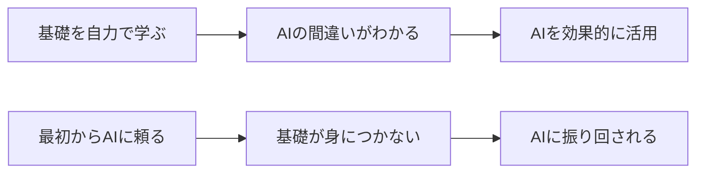

AI駆動開発（09番）に到達するまでは、自分の力でコードを書いて基礎を固めましょう。基礎があってこそ、AIを効果的に活用できます。

### 学習方法について

#### Q: わからないことがあったらどうすればいいですか？

**A**: 以下の順番で対処してください：
1. 公式ドキュメントを読む（10分）
2. ググる（10分）
3. エラーメッセージを読む（自動フィードバックを確認）
4. Slackで質問（30分悩んだら）

> 💡 **自動フィードバック**: PRでテストが失敗した場合、自動でヒントがコメントされます。まずはそれを確認してください。

#### Q: 1日どのくらい学習すればいいですか？

**A**: 1日6-8時間を目安にしてください。ただし、レベルによって調整できます：

| レベル | 推奨時間 | 補足 |
|--------|----------|------|
| 初心者 | 6-8時間 | じっくり取り組む |
| 基礎経験者 | 5-7時間 | 効率よく進める |
| 経験者 | 4-6時間 | 弱点に集中 |

無理せず、継続することが大切です。

> 💡 **進捗管理**: 毎日の自己診断を記入することで、モチベーション監視システムが自動で分析し、必要に応じてメンターにアラートを送ります。メンターが適切なサポートを提供できます。

#### Q: 土日も学習した方がいいですか？

**A**: 基本は平日のみで大丈夫です。遅れが気になる場合は、メンターと相談してください。

---

## 📊 進捗管理

### 進捗の記録

`progress/students/{your-name}/progress.md` に進捗を記録してください。

```markdown
## 共通基礎

| カテゴリ | 状態 | 開始日 | 完了日 | メモ |
|----------|------|--------|--------|------|
| Git基礎 | ✅ 完了 | 01/06 | 01/07 | ブランチ戦略を理解した |
| プログラミング基礎 | 🔄 進行中 | 01/08 | - | 型システムが難しい |
| ソフトウェア設計 | ⏳ 未着手 | - | - | - |
```

**凡例**: ✅ 完了 / 🔄 進行中 / ⏳ 未着手

---

## 8. コンテンツの改善に貢献する

研修コンテンツの品質向上のため、フィードバックを歓迎します！

### 8.1 問題を見つけたら

| 問題の種類 | 対応方法 |
|-----------|---------|
| 誤字脱字、リンク切れ | 直接PRを作成 |
| 内容の誤り | [Issue](../../issues/new?template=content-error.yml)で報告 |
| わかりにくい | [Issue](../../issues/new?template=content-improvement.yml)で報告 |
| 追加要望 | [Issue](../../issues/new?template=content-improvement.yml)で報告 |

### 8.2 報告の仕方

1. [Issues](../../issues) ページを開く
2. 「New issue」をクリック
3. テンプレートを選択して記入

### 8.3 自分で修正する場合

軽微な修正（誤字脱字など）は、直接PRを作成できます。

```bash
# 修正用ブランチを作成
git checkout -b fix/content-typo-git-basics

# 修正を行う
# ...

# コミット & プッシュ
git add .
git commit -m "fix: Git基礎の誤字を修正"
git push origin fix/content-typo-git-basics
```

詳しくは [コンテンツ改善ガイド](contributing.md) を参照してください。

---

## ✅ 研修開始チェックリスト

学習を始める前に、以下が完了していることを確認してください：

### 環境構築
- [ ] Git がインストールされている（`git --version`で確認）
- [ ] Node.js (v18以上) がインストールされている（`node --version`で確認）
- [ ] Cursor がインストールされている
- [ ] Docker がインストールされている（`docker --version`で確認）

### リポジトリ設定
- [ ] リポジトリをクローンした
- [ ] 進捗管理フォルダを作成した（`progress/students/{your-name}/progress.md`）
- [ ] 進捗ファイルのテンプレートをコピーした

### メンターとの連携
- [ ] メンターと顔合わせをした
- [ ] 1on1のスケジュールを確認した
- [ ] Slackの使い方を確認した

### 自動化システムの理解
- [ ] PR提出後の自動テストについて理解した
- [ ] 自動フィードバックの仕組みを理解した
- [ ] 進捗ファイルの自動更新について理解した

**すべてチェックが付いたら、学習を開始してください！**

📁 **最初のコンテンツ**: [content/common/00-engineer-mindset/README.md](../content/common/00-engineer-mindset/README.md)

---

**それでは、研修を始めましょう！** 🚀

わからないことがあれば、いつでもメンターに相談してください。一緒に頑張りましょう！

---

## 🎓 修了証について

### 修了証の発行

コースを完了すると、**修了証**と**評価レポート**が自動生成されます。

#### 発行される修了証

1. **共通基礎コース修了証**
   - 共通基礎（00-10）の全カテゴリを完了した場合
   - すべての課題とテストに合格した場合

2. **コース別修了証**
   - Webエンジニアコース修了証
   - モバイルエンジニアコース修了証
   - IoTエンジニアコース修了証
   - コース別の全カテゴリと応用演習を完了した場合

3. **前提条件コース修了証**（経験エンジニア向け）
   - AI駆動開発前提条件コースを完了した場合
   - 詳細は[経験エンジニア向け AI駆動開発前提条件コース](experienced-engineer-prerequisites.md)を参照

#### 修了証の内容

- 研修生名
- コース名
- 修了日
- メンター署名
- 評価レポート（成績、フィードバック等）

#### 保存場所

修了証と評価レポートは以下の場所に保存されます：

- **修了証**: `progress/students/{受講者名}/certificates/`
  - Markdown形式: `certificate-{コース名}-{日付}.md`
  - PDF形式: `certificate-{コース名}-{日付}.pdf`
- **評価レポート**: `progress/students/{受講者名}/reports/`
  - `report-{コース名}-{日付}.md`

#### 自動生成のタイミング

修了証は以下のタイミングで自動生成されます：

- コース完了を検知した時（進捗ファイルの更新を監視）
- GitHub Actionsワークフローによる自動実行
- メンターによる手動実行

#### 修了証の確認方法

1. ローカルファイルを確認
   ```bash
   ls progress/students/{your-name}/certificates/
   ```

2. GitHub Releaseを確認
   - コース完了時に自動でGitHub Releaseが作成されます
   - 修了証と評価レポートが添付されます

## 📚 関連ドキュメント

- [研修生向けクイックスタート](student-quick-start.md) - **最初に読む（簡易版）**
- [カリキュラム概要](curriculum-overview.md) - 学習内容の全体像
- [経験エンジニア向け AI駆動開発前提条件コース](experienced-engineer-prerequisites.md) - 経験エンジニア向け
- [実装状況](implementation-status.md) - 実装済み機能の一覧
