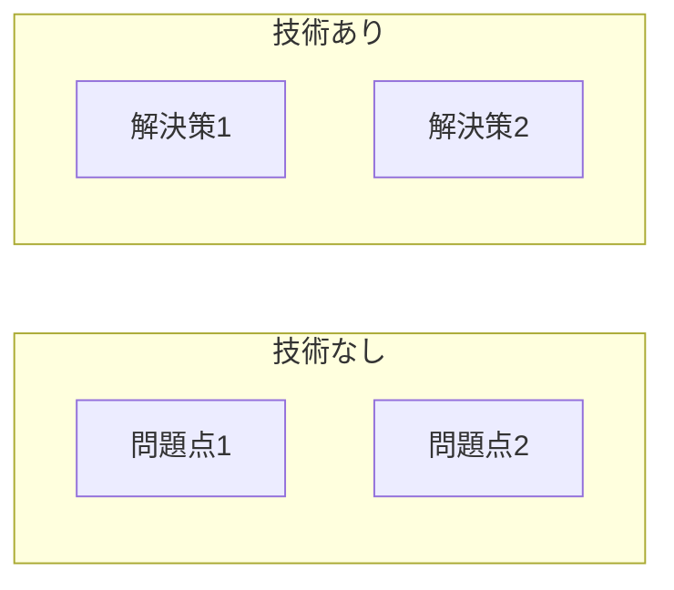
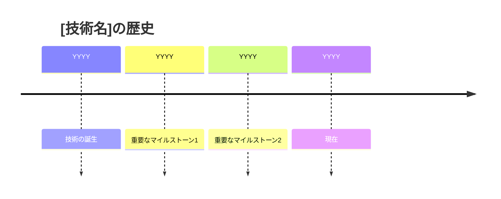
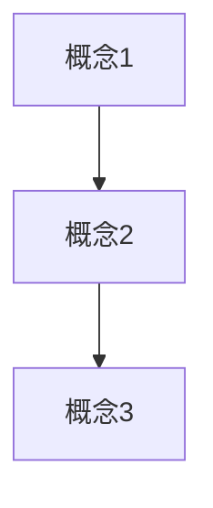

# [コンテンツタイトル]

**難易度**: [基礎] / [中級] / [応用]  
**学習時間**: 約XX分

## なぜ学ぶ必要があるのか

### この技術が解決する問題

<!-- 
この技術がなかった場合の問題点と、
この技術があることで解決できることを説明します。
図を使うと理解しやすくなります。
-->



<!-- 具体的な問題と解決策を記載 -->

- **問題1**: [問題の説明]
- **解決1**: [解決策の説明]

### 実務での重要性

<!-- 実際の開発現場でどのように使われているかを説明します -->

- [実務での使用例1]
- [実務での使用例2]
- [業界での採用状況]

### AI時代における重要性

<!-- AI駆動開発において、なぜこの基礎知識が必要なのかを説明します -->

- **AIの間違いを見抜く**: [この知識がないとAIの間違いをどう見落とすか]
- **正しい指示を出す**: [この知識があるとAIにどう正確な指示を出せるか]

### 学習のゴール

このコンテンツを学ぶことで、以下ができるようになります：

- [ ] [ゴール1]
- [ ] [ゴール2]
- [ ] [ゴール3]

## 技術の歴史的背景

### 技術の誕生

<!-- いつ、誰が、なぜこの技術を作ったのかを説明します -->



- **[年]**: [出来事の説明]
- **背景**: [なぜその技術が作られたか]

### 進化の過程

<!-- 技術がどのように進化してきたかを説明します -->

| 年 | バージョン/出来事 | 主な変更点 |
|----|------------------|-----------|
| YYYY | [バージョン/出来事] | [変更点] |

### 業界への影響

<!-- 技術が業界に与えた影響を説明します -->

- [業界への影響1]
- [業界への影響2]

## 技術的な内容

### 基本概念

<!-- 技術の基本的な考え方を説明します -->

#### [概念1]

[概念の説明]



#### [概念2]

[概念の説明]

### 実装方法

<!-- 実際の使い方をコード例で説明します -->

#### 基本的な使い方

```typescript
// コード例
const example = "Hello, World!";
console.log(example);
```

#### [ユースケース1]

```typescript
// ユースケースのコード例
```

### ベストプラクティス

<!-- 推奨される使い方、よくある間違いを説明します -->

#### 推奨事項

- ✅ [推奨事項1]
- ✅ [推奨事項2]

#### よくある間違い

- ❌ [よくある間違い1]
- ❌ [よくある間違い2]

### 実践例

<!-- 実際のプロジェクトでの使用例を説明します -->

```typescript
// 実践的なコード例
```

## まとめ

### 重要なポイント

1. **[ポイント1]**: [説明]
2. **[ポイント2]**: [説明]
3. **[ポイント3]**: [説明]

### 次のステップ

- [次に学ぶべきこと]
- [関連するコンテンツへのリンク]

[次へ: [次のコンテンツタイトル] →](次のコンテンツへのパス)

## 確認テスト

1. [質問1]
2. [質問2]
3. [質問3]

## 参考リソース

- [リソース1](URL)
- [リソース2](URL)

---

**ヒント**: わからないことがあれば、[GitHub Discussions](https://github.com/honeycome-bootcamp/bootcamp-v2/discussions)で質問してください！
